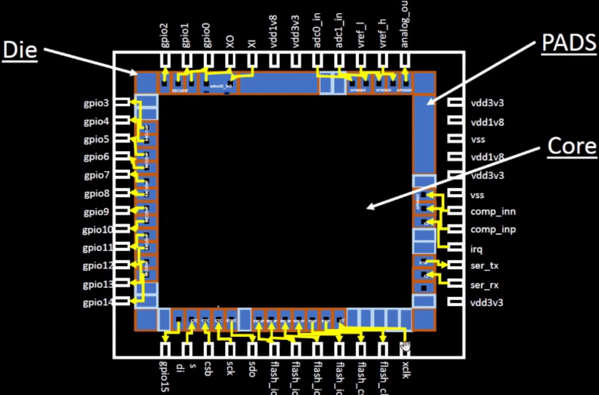

# Chip Overview

A chip is a package of circuits, containing many electronic components (often millions) like transistors. These components are arranged to form electronic circuits to perform functions like processing and storing data.

## Chip Components

### Pads

All chips have a way to interface and communicate with external data. Often, this is through data pins.

Pads help to form a bridge between the chip's internals and the outside world. Signals are send through the pads and into the chips.

### Core

The core of the chip is where all the digital logic is placed. The electronic components, like the transistors, are used to form logic gates. All the processor's functions are in the core.

### Die

The die is a piece of semiconducting material (usually silicon). The microchip is fabricated on top of the die. Dies are helpful in mass production, since multiple chips (also called integrated circuits - IC) can be made on a single wafer.

### Foundry Intellectual Property

Oftentimes, a chip foundry will provide certain components to the chip designer. These pre-made designs are heavily tested, reliable, and efficient.

One can think of a foundry IP like this: imagine building a Lego set. You, the builder, are the one who puts the blocks together. You can put them in any configuration you want to. However, you aren't the one who makes the plastic pieces themselves. Foundry IPs are like the pre-manufactured Lego parts. They are given to the builder to use how they want. This helps to speed up the chip making process since you don't have to design every circuit yourself and instead can use something that is proven to work.

### Macros

Macros are like foundry IPs but are just pure digital logic.
