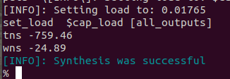

# OpenLANE Tools

Open the virtual machine. I used VMWare Workstation Pro, but you can use any other software you want.

:::warning

Mac support on Apple Silicon devices is not as good as Linux/Windows/Intel Macs. It is suggested to either:

A: use a different device.
B: install Parallels or some other software that supports Apple Silicon Macs.

:::

## Start the Tools

Make sure you are in `/home/vsduser/Desktop/work/tools/openlane_working_dir/openlane`.

```bash showLineNumbers title="vsduser@vsdsquadron: ~/Desktop/work/tools/openlane_working_dir/openlane"
# create this alias so you don't need to type the long command
alias docker='docker run -it -v $(pwd):/openLANE_flow -v $PDK_ROOT:$PDK_ROOT -e PDK_ROOT=$PDK_ROOT -u $(id -u $USER):$(id -g $USER) efabless/openlane:v0.21'

# open the docker environment
docker

# enable interactive mode
./flow.tcl -interactive

# load openlane package
package require openlane 0.9

# prep and run your design
prep -design picorv32a
```


## Run Everything

### Synthesis

```bash showLineNumbers title="vsduser@vsdsquadron: ~/Desktop/work/tools/openlane_working_dir/openlane"
# run the synthesis. this will display a lot of text in the terminal.
# it will tell you if it was a success at the end.
run_synthesis
```



### Calculate the Flop Ratio

Open `~/Desktop/work/tools/openlane_working_dir/openlane/designs/picorv32a/runs/<latest run>`.

All the files generated are stored in the `reports/` directory. Open it and see what's there! The reports from `run_synthesis` are stored in `synthesis/`. Open the folder and run `ls -l` to see the files.

Run `cat 1-yosys_4.stat.rpt` to see the synthesis statistics. We will use this to make our calculations.

:::warning

The numbers in your file *may* be different. However, the calculation process is still the same.

:::

```title="1-yosys_4.stat.rpt"
    Number of wires:                14596
    Number of wire bits:            14978
    Number of public wires:         1565
    Number of public wire bits:     1947
    Number of memories:             0
    Number of memory bits:          0
    Number of processes:            0
    // highlight-next-line
    Number of cells:                14876

    [content hidden]

        sky130_fd_sc_hd__conb1      42
        // highlight-next-line
        sky130_fd_sc_hd__dfxtp_2    1613
        sky130_fd_sc_hd__inv_2      1615

    [content hidden]
```

$Flop \space Ratio = \frac{\# \space of \space D \space flip\space flops}{Total \space \# \space of \space cells}$

$\% \space of \space DFFs = Flop \space Ratio \times 100$

$Flop \space Ratio = \frac{1613}{14876} \approx 0.10843$

$\% \space of \space DFFs = 0.10843\times 100 = 10.843 \%$
