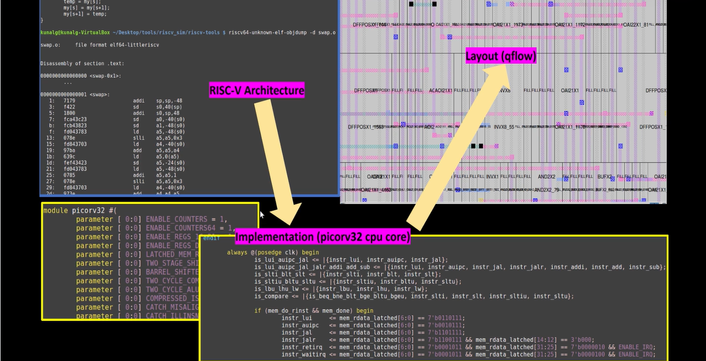
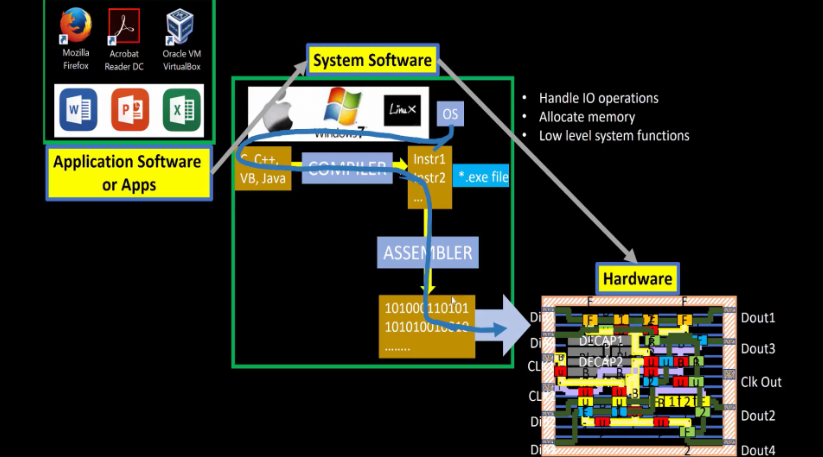

# Risc-V

RISC-V is an instruction set architecture (ISA). The ISA is how software communicates with the hardware, and it is the interface between the two.

Common ISAs include:

* x86 - one of the oldest and most known ISAs. It was developed by Intel and AMD and is widely used in PCs and servers.
* ARM - often used in mobile devices and embedded systems due to its power efficiency, although it's becoming more popular for desktop usage
* MIPS - usually used in embedded systems or networking

RISC-V is open-source and free! This makes it highly accessible and easy to work with.

## Risc-V Workflow

1. Coding languages, like C, are converted into assembly language programs. In our case, it would be RISC-V.
2. The RISC-V code is turned into machine language.
3. The machine language can be turned into an HDL (hardware description language). In the diagram, we use "picorv32 cpu core."

## Software → Hardware

Application software are the apps that you use everyday. They are things like web browsers, games, office apps, messaging, etc. They are not the operating system (OS). Most apps are coded in higher level languages. However, computers can't read these languages directly. That's where the operating system comes in.

All apps sit on top of the system software, or the OS. The OS contains software, like compilers and assemblers, along with software to handle input/output (IO), memory management, and other low level functions. The OS is what turns apps into machine language and runs it on the hardware.

The hardware is the lowest layer. This is where the apps that were converted into machine language by the OS are run.

The overall work flow is: App → System software (OS → Compiler → Assembler) → Hardware
