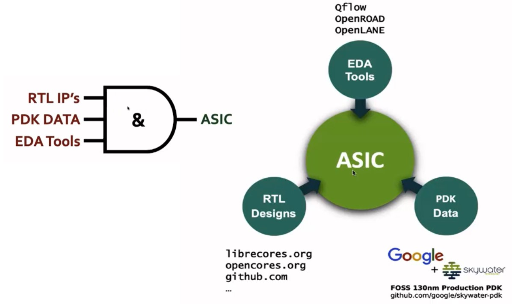
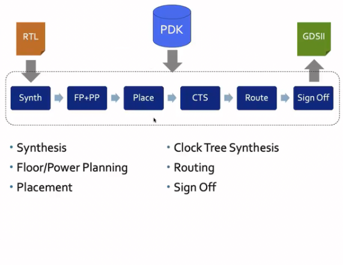
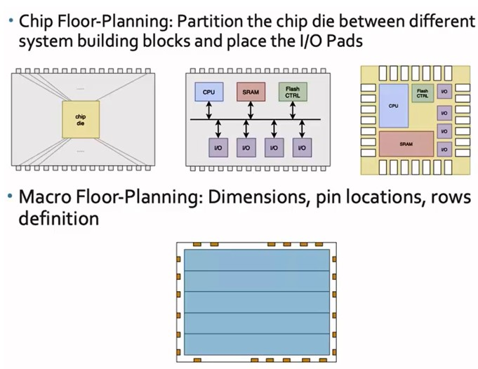
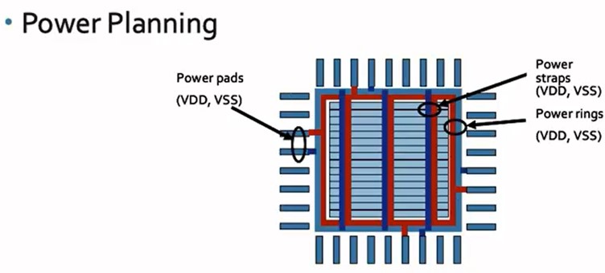
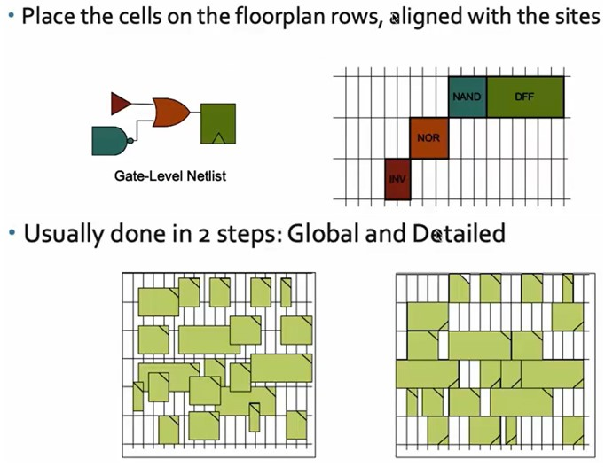
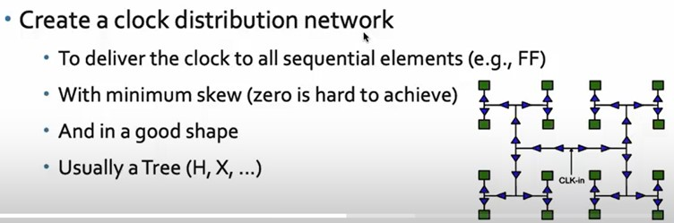
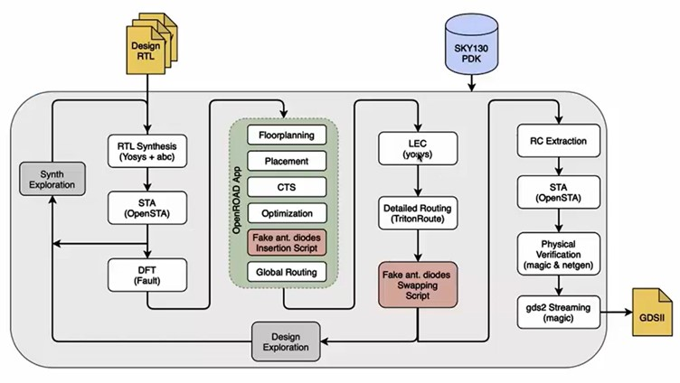
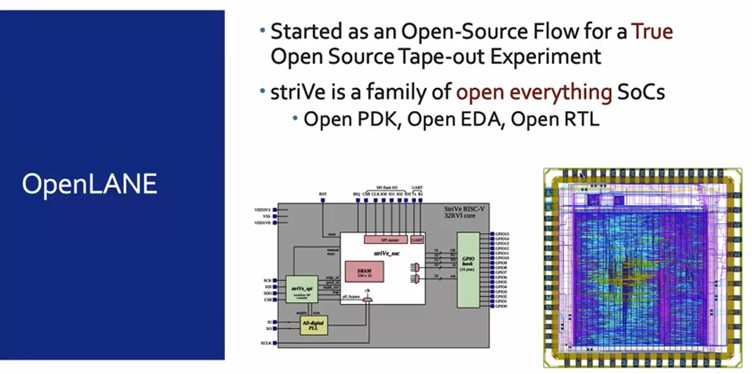
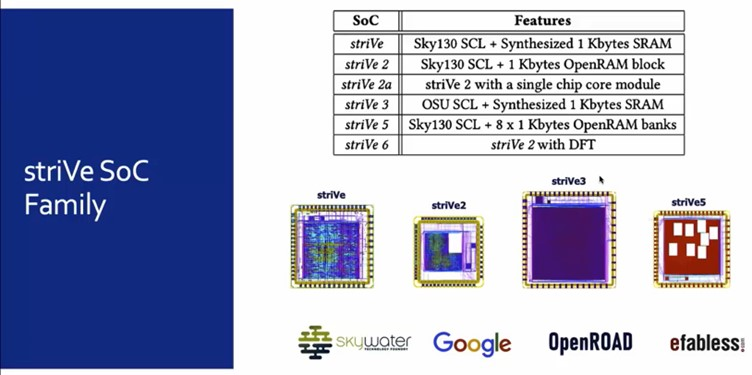

# SoC Design and OpenLANE

## How ASIC Design Works

There are three parts for ASIC design:

1. **RTL IPs:** Register Transfer Level Intellectual Properties are pre-designed and pre-verified hardware components written in an HDL. They help to abstract chip-design by providing a user-friendly interface for a designer to work with.
2. **EDA Tools:** Electronic Design Automation tools help to simulate and verify circuit designs. They speed up the design workflow and ensure that things work properly without having to manufacture hardware.
3. **PDK Data:** Process Design Kit data are the files for modeling the fabrication process. It tells the EDA how a chip should be designed and the rules for designing the chip. These files are provided by the foundry.

### Opensource ASIC Design

* Tools like OpenROAD and OpenLANE are open source EDAs
* The Google x Skywater 130nm chip PDKs were made open source. They helped make chip design more accessible.

### ASIC Design Workflow

#### RTL → Synthesis (Synth)

RTL code is turned into a netlist, or a circuit. It converts them by using a standard cell library, which is a collection of pre-made digital logic components.

#### Floor Planning (FP) and Power Planning (PP)

All parts of the chip undergo floor planning. This means placing components and optimizing where they are put. It helps to minimize wire length, reduce signal delay, optimize power distribution, and ensure the chip's area is efficiently used.

Power planning helps to create a power grid using VDD/VSS ports. Planning helps to ensure all components get the right amount of power, and it makes sure that the power is steady and consistent (minimizing voltage drops/spikes, noise, etc).

#### Placement (Place)

Each component needs to be properly placed on the chip. Standard cells are placed in rows as defined by the floor plan.

The placement is a two step process:

1. **Global planning:** the chips are placed roughly where they need to be
2. **Details planning:** the chips are properly aligned and this is where minor adjustments are made

#### Clock Tree Synthesis (CTS)

The clock distribution network is built. This ensures the clock signal is delivered to any components that need it and makes sure that the clock signal is synchronized with all parts.

#### Routing (Route)

All physical wires, or interconnects, are added. It connects the cells and the metal layers.

The Skywater 130nm PDK (SKY130) has 6 layers. The lowest is titanium nitride and is for the interconnects. The rest are aluminum.

Similar to the placement stage, routing is done in two steps:

1. **Global routing:** the general routing is done here
2. **Detailed routing:** finer adjustments are made

#### Sign Off → GDSII

This is the verification process.

The design undergoes:

1. **Physical verification**
   1. **Design Rules Checking (DRC):** makes sure the design abides by manufacturing rules. This prevents fabrication defects and errors.
   2. **Layout vs. Schematic (LVS):** confirms that the manufactured layout is the same as the original circuit schematic
2. **Timing verification**
   1. **Static Timing Analysis (STA):** makes sure the chip meets the required performance/speed needs. Also make sure the clock is working properly.

## OpenLANE and StriVe

OpenLANE is an open source ASIC. It automates the chip design process, taking you from RTL to GDSII within a single ecosystem.

The workflow is described below:

1. **Synthesis Exploration:** a report comparing delay and area is generated.
2. **Design Exploration:** performance metrics for different layouts and configurations are calculated. Regression testing is also performed to find the best configuration for a design.
3. **Design For Test (DFT):** logic is added to make chips testable after production.
4. **Physical Implementation (PnR):** OpenROAD automatically performs the placing and routing.
   1. **Logic Equivalence Check (LEC):** the circuit's functions are verified. This ensures that everything works as it was described by the design files. The reason is because during optimization or CTS, the circuit can change. We don't want any errors to pop up afterwards.
   2. **Antenna Diodes:** long metal wires act as antennas, collecting charge that can damage the chip. Any wires that act as antennas need to be dealt with properly.

### Tool: OpenLANE

### SoC: StriVe

### PDK: Made for SkyWater 130nm PDK

