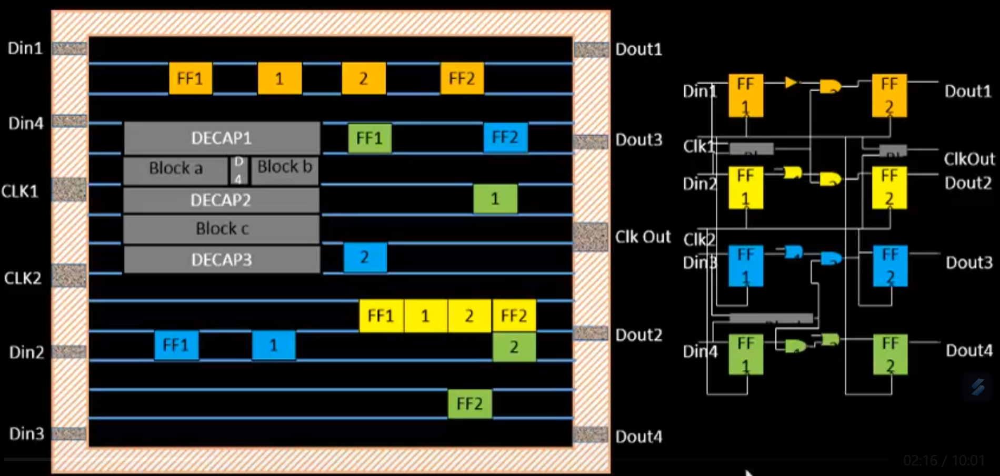
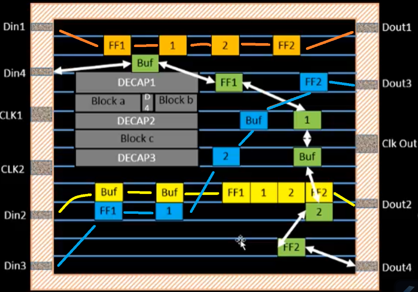

# Binding and Placement

**Logical gates in the netlist are abstract.** For example, an AND gate in your schematic is just a symbol. But to actually make it on a chip, you need to pick a real, physical implementation of that gate — with transistors laid out, wiring, dimensions, etc. This is done by **binding** the netlist to a **standard cell library.**

By binding the netlist to the standard cell library, you can translate the design into actual hardware.

## Wiring

All the components need to be connected with wires. However, wires that are too long need repeaters between the connection points to maintain signal integrity. An algorithm is used to determine the optimal placement of repeaters such that it minimizes the number of repeaters used.

## RePLACE

We need to optimize the placement of components:

1. **Global placement:** uses RePlace to put things roughly where they need to be.
2. **Optimization:** uses Resier to optimize placement
3. **Detailed Placement:** uses OpenDP to place standard cells in rows and prevent overlapping cells
