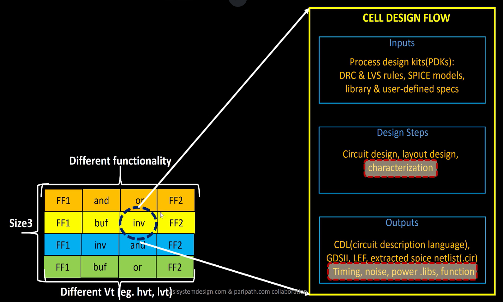

# Cell Design

## Inputs for Standard Cell Design Flow

A **standard cell** (like an AND gate, OR gate, buffer, etc.) is a reusable, pre-characterized building block for digital ICs. These cells are stored in a **standard cell library**, which provides multiple versions of each cell — varying by drive strength, threshold voltage $V_{th}$, and size. Larger cells have higher drive strength to handle longer wires or larger loads, while low-$V_{th}$ cells switch faster but may leak more power.

**Key inputs for designing a standard cell library:**

1. **PDKs (Process Design Kits)**
   1. **DRC (Design Rule Check) & LVS (Layout Versus Schematic)** rules: Define fabrication constraints, minimum feature sizes, metal spacing, poly layers, well taps, etc.
   2. **Tech files:** Define layers, masks, and process-specific parameters.
2. **SPICE Models**
   1. Transistor-level models for NMOS and PMOS devices.
   2. Include equations for threshold voltage, saturation, and linear regions, plus foundry-specific parameters for accurate simulation.
3. **User-Defined Specs**
   1. Target cell height and width (fits the standard cell row grid).
   2. Supply voltage $V_{dd}$, pin locations, metal layer usage.
   3. Design goals for power, speed, and noise margin.

## Processes: Circuit, Layout & Characterization

The **standard cell design flow** turns these inputs into manufacturable, reusable cells:

1. **Circuit Design**
   1. Transistor-level schematics are created using NMOS and PMOS models.
   2. Sizing is optimized to meet performance, power, and fan-out requirements.
2. **Layout Design**
   1. Physical layout is drawn based on the schematic.
   2. Techniques like **Euler paths** and **stick diagrams** help create compact, efficient transistor arrangements.
   3. Tools like **Magic**, **Cadence Virtuoso**, or **Synopsys Custom Compiler** are commonly used.
3. **Characterization**
   1. Cells are simulated using SPICE to extract real-world timing, power, and noise data. Output files are generated for use by EDA tools during synthesis and place-and-route. The finished cell netlists and SPICE models are given to characterization software (such as GUNA) through a configuration file. This flow typically includes:
      1. Reading SPICE model files
      2. Reading the netlist extracted from the schematic/layout
      3. Recognizing circuit behavior (e.g., buffer or gate type)
      4. Reading subcircuits and connecting power sources
      5. Applying input stimulus (test vectors)
      6. Adding output capacitance to model real loading conditions
      7. Running SPICE simulations with proper commands
      8. The output is a set of .lib files describing timing, noise, and power — these are essential for synthesis, static timing analysis, and physical design.

## Outputs: What the Library Provides

A finished standard cell library includes:

* **Circuit Description:** Schematic netlist (e.g., in CDL format)
* **Layout Data:** GDSII (geometry), LEF (abstract physical data)
* **Timing and Noise Models:** Liberty (.lib) files for synthesis and static timing analysis
* **Parasitic Data:** Resistance, capacitance, and noise behavior for accurate post-layout simulation.

:::warning

The entire cell design must **strictly follow foundry DRC and LVS rules** — any violations can cause the cell to fail manufacturing checks or introduce errors when integrated in a real chip.

:::

