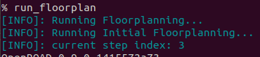
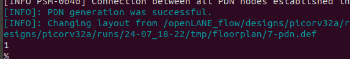
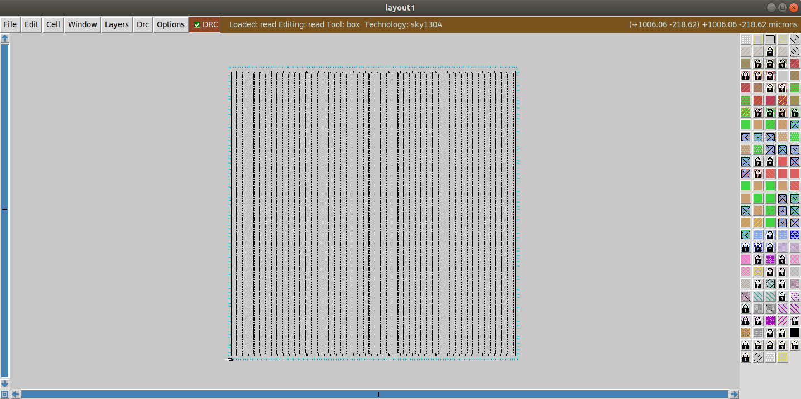
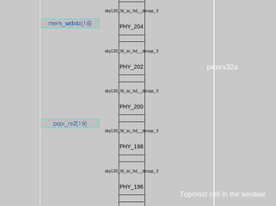
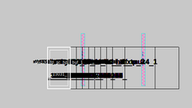
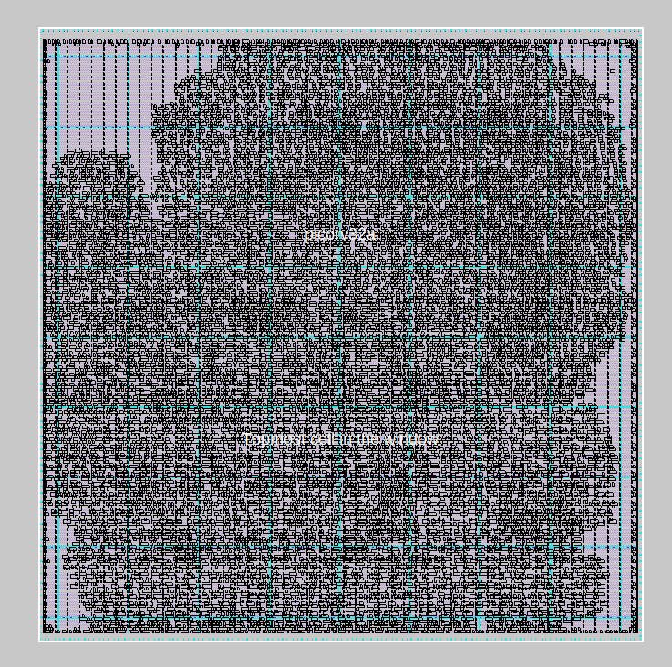
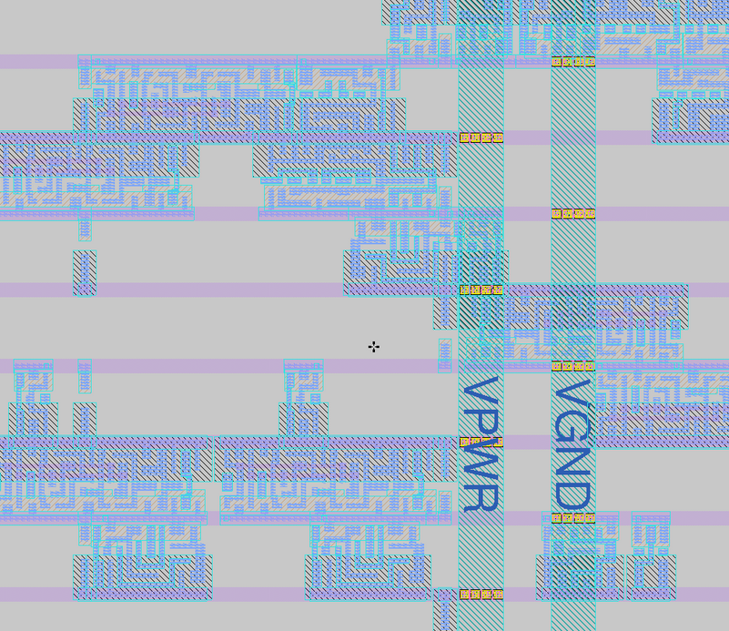

# Floorplanning in OpenLANE

## Create the Floorplan

Make sure you ran the command specified in Day 1:

```bash showLineNumbers title="vsduser@vsdsquadron: ~/Desktop/work/tools/openlane_working_dir/openlane"
docker
./flow.tcl -interactive
package require openlane 0.9
prep -design picorv32a
run_synthesis
```

Run the floorplan:

```bash showLineNumbers title="vsduser@vsdsquadron: ~/Desktop/work/tools/openlane_working_dir/openlane"
run_floorplan
```





### Calculate Die Area

Open `~/Desktop/work/tools/openlane_working_dir/openlane/designs/picorv32a/runs/<latest run>`.

Open `results/floorplan/`.

Run `nano picorv32a.floorplan.def` to view the reports.

```title="picorv32a.floorplan.def"
    VERSION 5.8 ;
    DIVIDERCHAR "/" ;
    BUSBITCHARS "[]" ;
    DESIGN picorv32a ;
    // highlight-next-line
    UNITS DISTANCE MICRONS 1000 ;
    // highlight-next-line
    DIE AREA ( 0 0 ) (660685 671405) ;


    [content hidden]
```

We know that *1000 units = 1 micron.*

* The die width in units: $660685 - 0 = 660685$.
* The die height in units: $671405 - 0 = 671405$.

To convert to microns: $\frac{Units}{1000}$

* The die width in microns: $\frac{660685}{1000} = 660.685$ microns.
* The die height in microns: $\frac{671405}{1000} = 671.405$ microns.

Die area in microns = $length \times width = 660.685 \times 671.405 = 443587.212425 \space microns^{2}$

## View the Floorplan in Magic

Let's open the floor plan in Magic. Make sure that you are in the same directory as you were before for the floorplan.

```bash showLineNumbers title="vsduser@vsdsquadron: ~/Desktop/work/tools/openlane_working_dir/openlane"
magic -T /home/vsduser/Desktop/work/tools/openlane_working_dir/pdks/sky130A/libs.tech/magic/sky130A.tech lef read ../../tmp/merged.lef def read picorv32a.floorplan.def &
```

:::tip

You can hit `S` on your keyboard to select the chip. Then, hit `V` to scale it to the entire window size (zoom in).

:::



**Placement of ports:**



**Standard cells that haven't been placed remain at the origin:**



## Run the Placement

```bash showLineNumbers title="vsduser@vsdsquadron: ~/Desktop/work/tools/openlane_working_dir/openlane"
# run the placement
run_placement


# open generated placement def
cd Desktop/work/tools/openlane_working_dir/openlane/designs/picorv32a/runs/{date}/results/placement/


# open with magic
magic -T /home/vsduser/Desktop/work/tools/openlane_working_dir/pdks/sky130A/libs.tech/magic/sky130A.tech lef read ../../tmp/merged.lef def read picorv32a.placement.def &
```



**Zoomed in view:**


