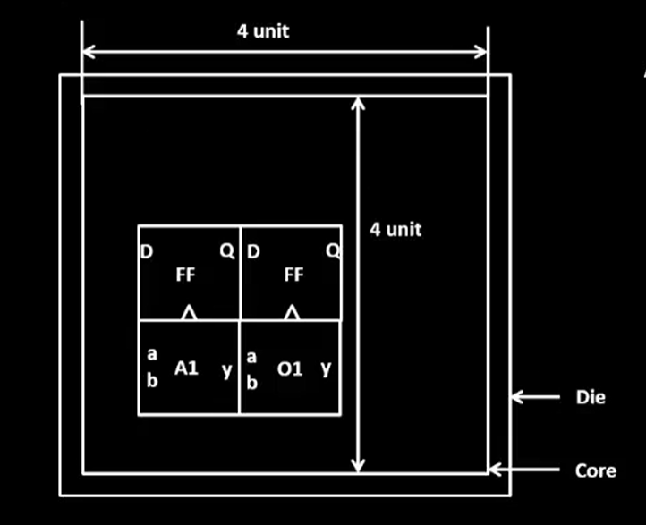
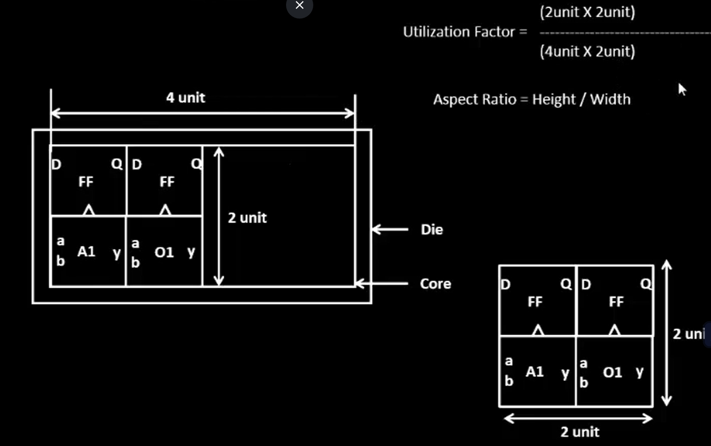
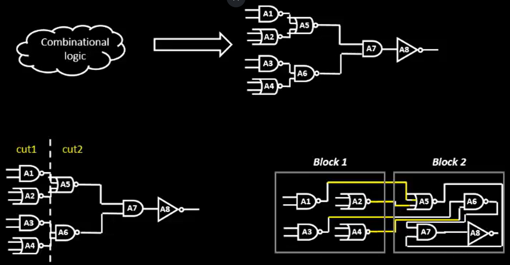
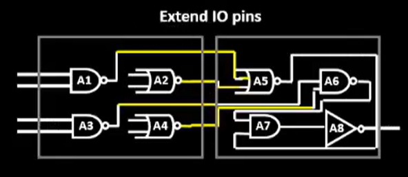
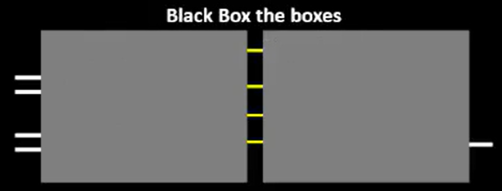
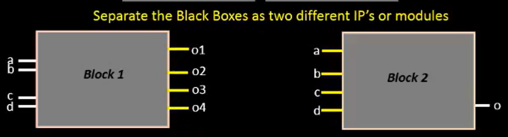
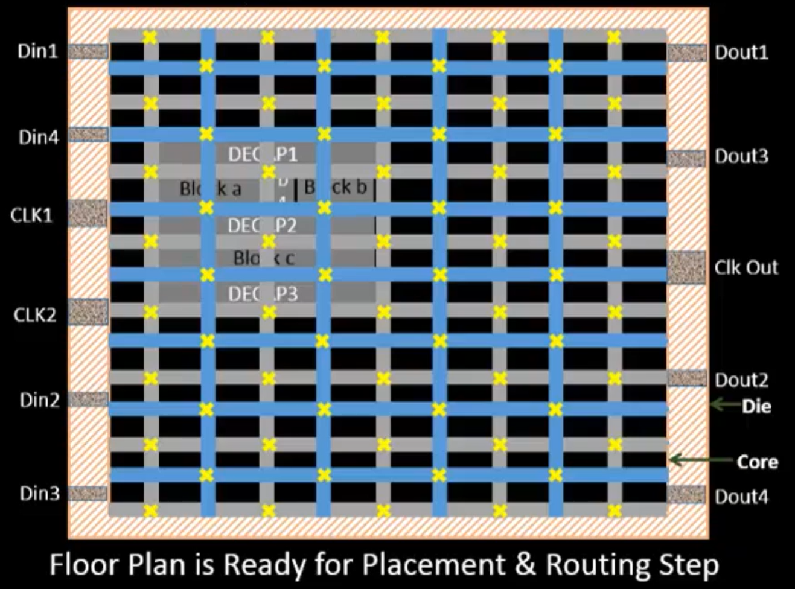

# Key Concepts

## Floorplanning In-Depth

### The Core and Die Overview

* **Core:** this is made from standard cells.
* **Die:** area around the core.
* **Utilization Factor:** netlist area / area of core. The factor tells you how much area is being used.
* **Aspect Ratio:** the height/width ratio of the chip.

### Preplaced Cells

These are reusable logic blocks that aren't affected by the auto place and routing systems. Preplaced cells are hand-placed by the designer according to their needs. Because they are user-designed, they need to be well-made.

The following is a diagram of how preplaced cells are made:

### Decoupling Capacitors (Decaps)

Preplaced cells need to be surrounded by decaps. Decaps help to stabilize the current draw and reduce noise. They also help to prevent large drops and spikes.

So, the preplaced cells will draw power from the decaps instead of directly from the power source. The decaps can be thought of as a stabilizing buffer.

### Power Planning

If we connected every component to one power source, we would experience instability because the components draw from the power at the same time. There would be large **voltage drops** when all the circuits turn on and **ground bounce** when they all shut off.

By distributing the power in a grid-like fashion, we ease the load. It's similar to how we have electrical grids in cities to take advantage of multiple power sources and drains.

### Clocks

To make the clock signal accurate and clean, the clock wires need to have less resistance. Also, the clock ports need to be larger than usual because they drive the entire chip. Unlike power sources, you can't have multiple clocks because there will be slight inconsistencies that cause timing issues and desynchronization.

### Standard Cell Library

**Definition:** a collection of pre-made logic gates. These serve as helpful building blocks that design tools use to make chips.

Each standard cell will have:

* Size
* Delay: the time for a signal to pass through
* Voltage: the voltage amount needed for operation
* IO: the location of input/output connections

### Finished Floorplan

This is the finished floorplan. We are now ready for placement and routing.
