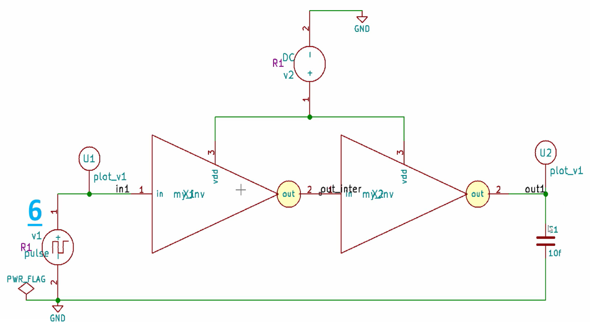
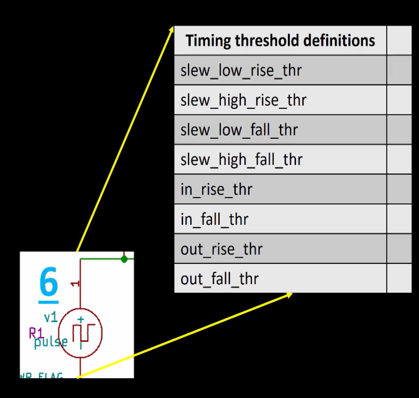
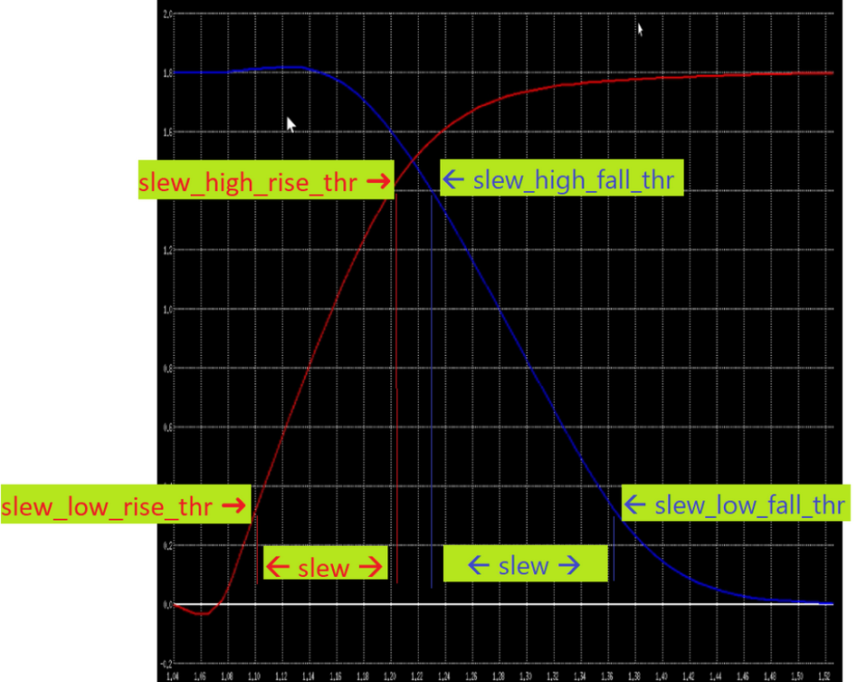
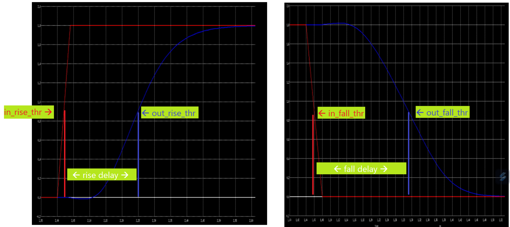
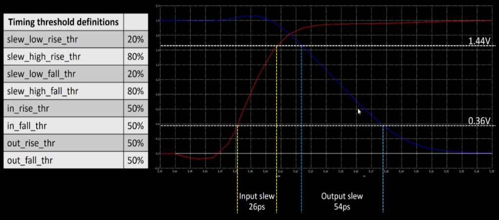

# Timing

## Timing Threshhold Definitions

Consider the following circuit:

Notice the following timing threshold definitions:

### Timing Charts

## Propogation Delay

Propagation delay is calculated as:

Propagation Delay = time(output crosses threshold) − time(input crosses threshold)

If the propagation delay is negative, it means the output appears to switch before the input does — which is physically impossible and can cause unexpected or misleading simulation results. To avoid this, it’s important to choose appropriate threshold levels when measuring delay.

Typically, the delay threshold is set at 50% of the signal’s voltage swing, while the slew rate (or transition time) is measured between 20% and 80% of the swing.

## Transition Time

Transition time (or slew rate) is calculated as:

Transition Time = time(signal crosses high threshold) − time(signal crosses low threshold)

For example, a common choice is to measure how long it takes a signal to rise from 20% to 80% of its maximum voltage level (or fall from 80% to 20% for a falling edge). This helps capture how quickly the signal transitions, which affects timing, noise, and overall circuit performance.

