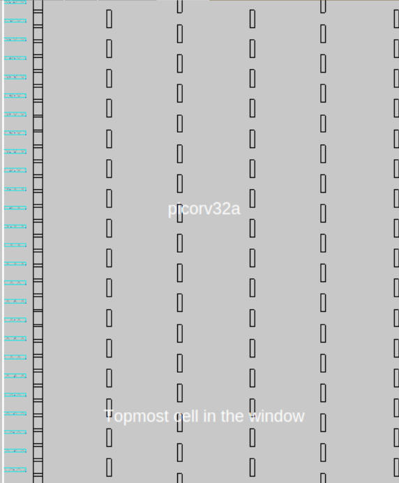
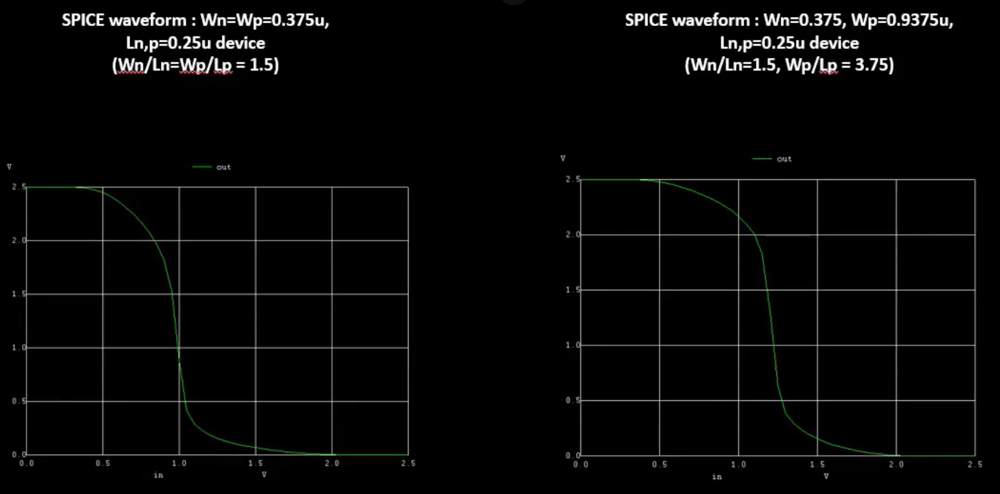
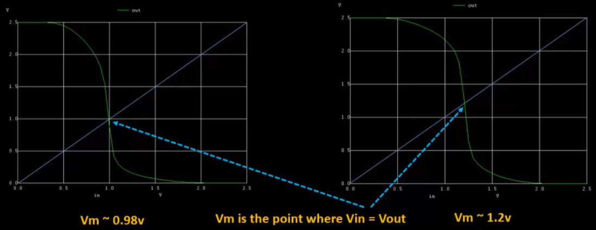
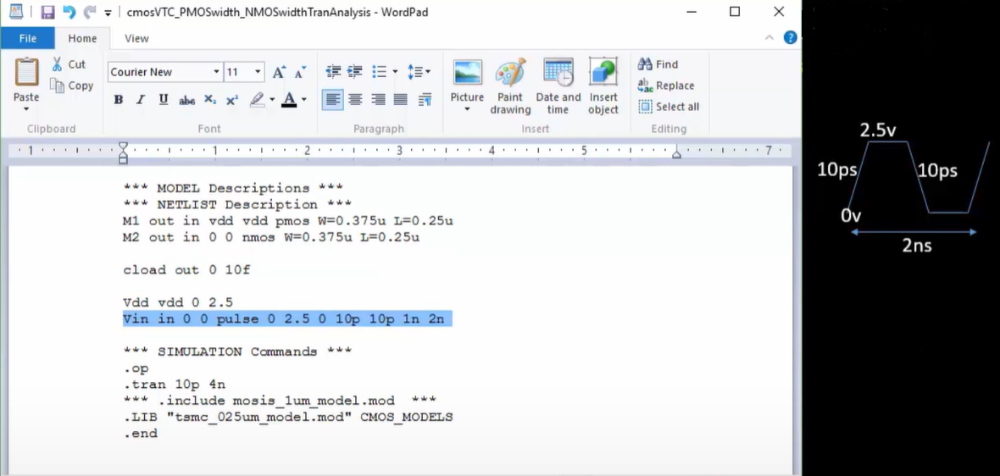

# CMOS Inverters and NGSPICE

## IO Characterization

You can change how OpenLANE places IO ports. Right now, they are evenly placed:

You can update the configuration file and re-run the floorplan command to build your chip again.

## SPICE for the CMOS Inverter

A SPICE simulation is a tool that analyzes the behavior of electronic circuits. It simulates circuit performance, computing various parameters such as current, voltage, and power under different conditions. This helps identify issues and optimize designs.

Here is an example output from a SPICE simulation:

The input parameters are what change the CMOS' switching threshold and propogation delay. Because the graph shapes are similar, we know the CMOS is working properly and consistently.

### Switching Threshold

When the input and output voltage are equivalent, that means the PMOS and NMOS are in the saturation region. This is the switching threshold. At that point, the chances of leakage are increased.

### Propogation Delay

