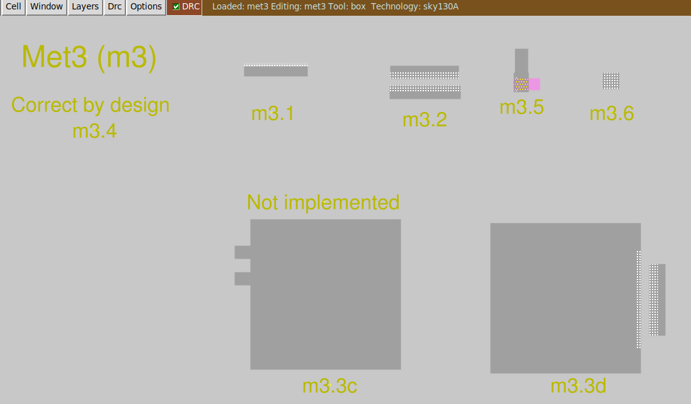
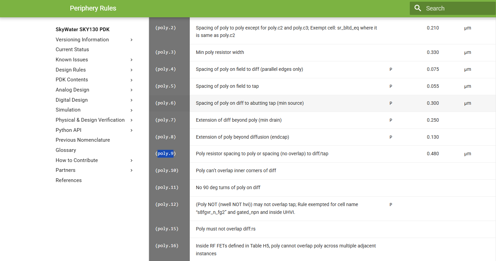
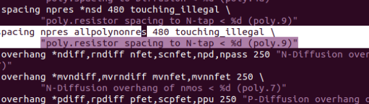

# DRC in Magic

## Download the Lab Files

```bash showLineNumbers title="vsduser@vsdsquadron: ~"
# go to home
cd

# donwload lab files
wget http://opencircuitdesign.com/open_pdks/archive/drc_tests.tgz

# extract it
tar xfz drc_tests.tgz

# open lab folder
cd drc_tests
```

## Open in Magic

```bash showLineNumbers title="vsduser@vsdsquadron: ~/drc_tests"
# show files
ls -al

# open .magicrc (close by with Ctrl + X)
nano .magicrc

# open it in magix
magic -d XR &
```

Open `met3.mag`: File > Open > met3.mag



## Finding and Fixing DRC Errors

Open [this link](https://skywater-pdk.readthedocs.io/en/main/rules/periphery.html) to learn more about the DRC rules.



Here is the change we made to the `.tech` file to fix the DRC error::



## Run DRC Again

```bash showLineNumbers title="tkcon 2.3 Main"
# load new tech file
tech load sky130A.tech

# re-run DRC
drc check

# select region with new errors 
drc why
```

After fixing all the errors, the designs will work properly.
