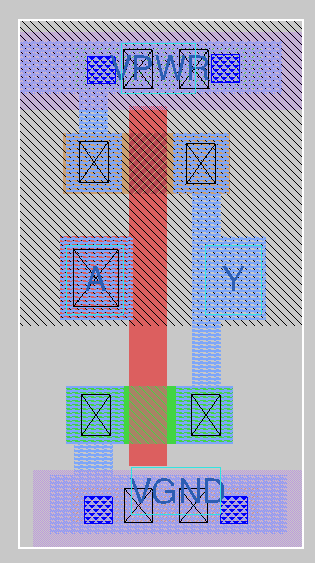
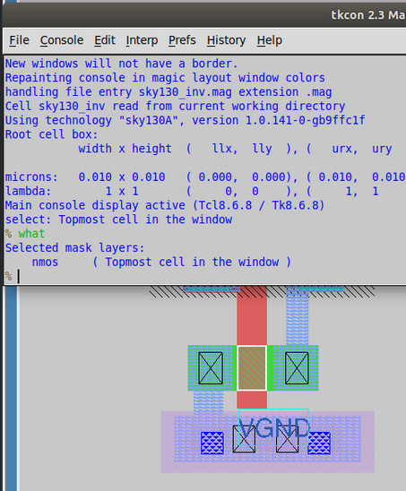
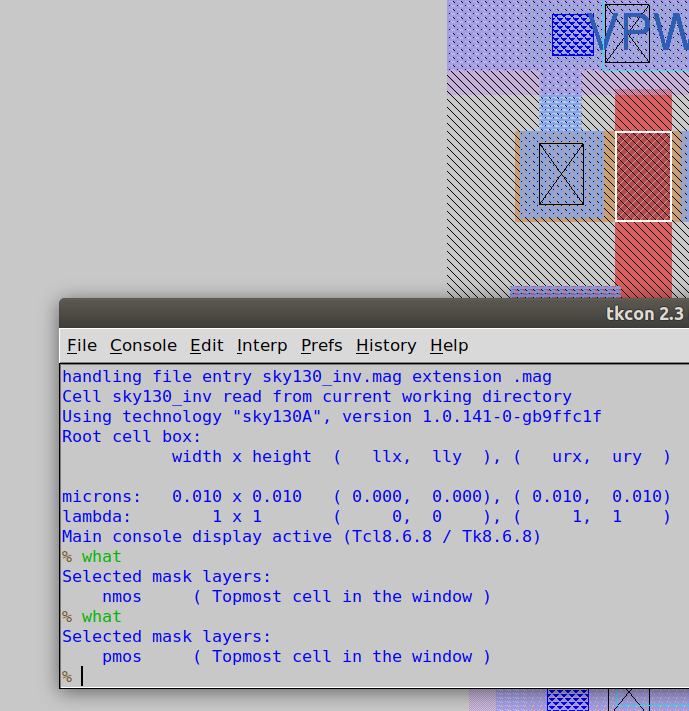
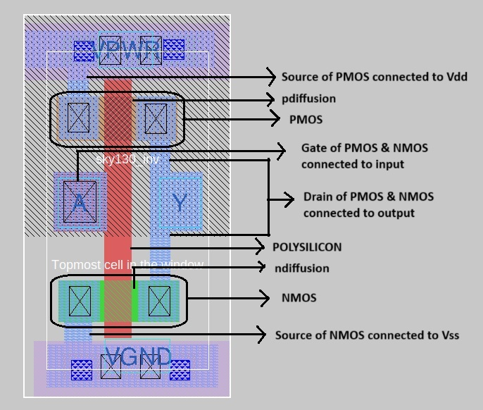
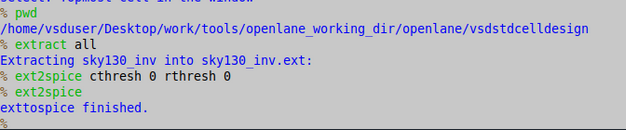
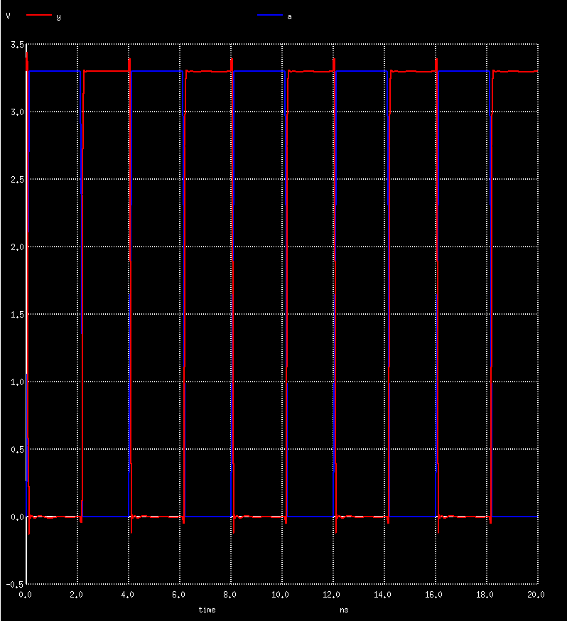
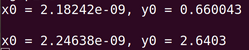
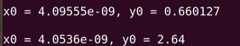
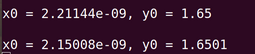
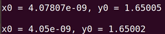

# Inverter Standard Cell Design in Magic

## Fetch the Files

```bash showLineNumbers title="vsduser@vsdsquadron: ~/Desktop/work/tools/openlane_working_dir/openlane"

# clone repo w/inverter design
git clone https://github.com/nickson-jose/vsdstdcelldesign

# open repo dir
cd vsdstdcelldesign

# copy magic tech file -> repo directory
cp /home/vsduser/Desktop/work/tools/openlane_working_dir/pdks/sky130A/libs.tech/magic/sky130A.tech .

# show files
ls -l
```

## Open in Magic

```bash showLineNumbers title="vsduser@vsdsquadron: ~/Desktop/work/tools/openlane_working_dir/openlane"
# open inverter in magic
magic -T sky130A.tech sky130_inv.mag &
```

You should see this:



## Identifying Layers

Select an object and type `what` in the terminal to see what it is.

Here is the NMOS:



Here is the PMOS:



### Annotated Diagram



## SPICE Extraction

```bash title="tkcon 2.3 Main"
# verify where you are
% pwd

# extract to .ext
% extract all

# enable parasitic extraction
% ext2spice cthresh 0 rthresh 0

# convert ext -> spice
% ext2spice
```



Open the spice file:

```bash showLineNumbers title="vsduser@vsdsquadron: ~/Desktop/work/tools/openlane_working_dir/openlane/vsdstdcelldesign"
# open spice file
nano sky130_inv.spice
```

You can edit the spice file. Then, run the simulation using NGSPICE:

```bash showLineNumbers title="vsduser@vsdsquadron: ~/Desktop/work/tools/openlane_working_dir/openlane/vsdstdcelldesign"
# run ngspice
ngspice sky130_inv.spice

# plot the output
plot y vs time a
```

You will get the following graph:



## Rise and Fall Calculations

### Rise Transition Time

Rise transition time = time for output to rise to 80% - time for output to rise to 20%

- 20% of output = 660mV
- 80% of output = 2.64V



$RTT = 2.24638 - 2.18242 = 0.06396 \space ns = 63.96 \space ps$

### Fall Transition Time

Fall transition time = time for output to fall to 20% - time for output to fall to 80%

- 20% of output = 660mV
- 80% of output = 2.64V



$FTT = 4.0955 - 4.0536 = 0.0419 \space ns = 41.9 \space ps$

### Rise Cell Delay

Rise cell delay = time for output to rise to 50% - time for input to fall to 50%

- 50% of output (3.3V)= 1.65V



$RCD = 2.21144 - 2.15008 = 0.06136 \space ns = 61.36 \space ps$

### Fall Cell Delay

Fall cell delay = time for output to fall to 50% - time for input to rise to 50%

- 50% of output (3.3V)= 1.65V



$FCD = 4.07 - 4.05 = 0.02 \space ns = 20 \space ps$
