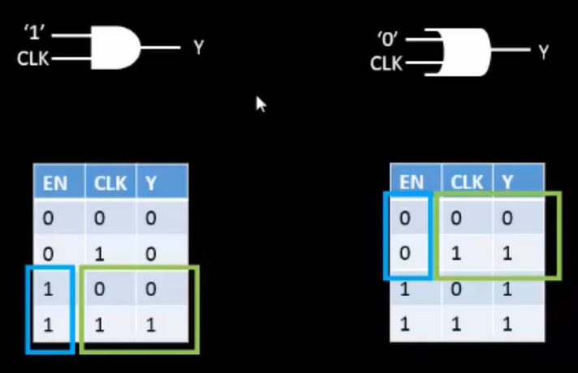
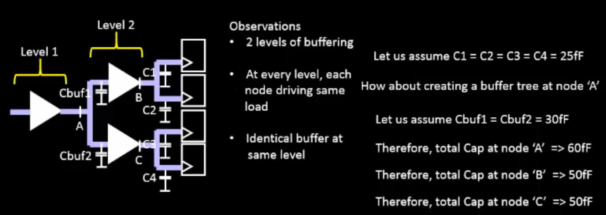
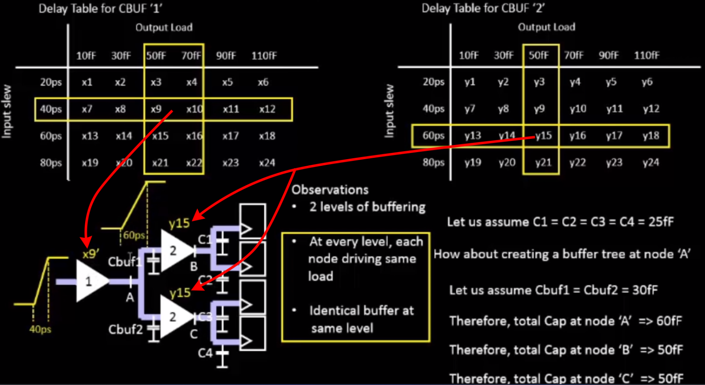

# Clock Gates

Clock trees are integral to circuit design. However, they can consume a lot of power. For a couple of circuits, this might not seem like much. However, the consumption can quickly add up over millions to billions of circuits. How do we solve this issue?

Most circuits use Clock Gating. This lets us enable and disable the clock and prevent excessive power consumption. We can turn the clock on when we need it and turn it off when we don't. We add an **enable pin** to circuits. This controls where the clock signal goes.

## Gate Logic Table

The image above illustrates how the enable pin controls clock propagation in different logic gate configurations.

* For an **AND** gate, the clock signal (CLK) propagates to the output **Y only when enable = 1**.
* For an **OR** gate, CLK reaches **Y only when enable = 0**.
* When the enable condition is not met, the clock is blocked — preventing unnecessary toggling and eliminating short-circuit power consumption.

## Physical Implementation

From the diagram above, we can observe that buffers at different levels of the clock tree experience different capacitive loads and therefore require different buffer sizes. As long as buffers at the **same level** have **identical sizes and loads**, the delay along each clock path remains equal, ensuring **zero clock skew**.

However, in real-world designs, it's rare for all levels to have perfectly matched input transitions and output loads. As a result, delays can vary across different branches of the clock tree.

To analyze and model these variations, we use delay tables associated with each cell, typically provided in .lib or .lef files. The key factor affecting delay is the output slew, which depends on:

* The capacitive load at the cell’s output, and
* The input slew, which in turn is determined by the previous stage’s output slew and load.

Each standard cell contains transition and delay lookup tables that allow synthesis and timing tools to estimate delays accurately under varying conditions.

At Level 2 in the clock tree, we observe that both buffers have **identical delays** because they *share the same input transition times, load capacitances, and buffer sizes*. As a result, the clock skew at that level is effectively zero.

However, if any of these parameters differ, skew is introduced — and if it becomes **negative**, it can lead to **timing violations** where signals arrive too early or too late. While small amounts of skew may be negligible in small-scale designs, they can become critical in large-scale systems with millions of cells. In such designs, even tiny inconsistencies can propagate and cause major timing-related failures if proper clock tree synthesis (CTS) guidelines aren't followed.

## Terms to Know

:::info[Vocab]

* **Clock Tree Synthesis (CTS):** The process of building a balanced clock distribution network that minimizes skew and ensures synchronized operation across the circuit.
* **Skew:** The difference in arrival times of the clock signal at different flip-flops or endpoints.
* **Slew (Rate):** The rate of change of a signal’s voltage over time — too slow or too fast a slew can cause setup/hold time violations.
* **Latency:** The total delay experienced by the clock signal from the clock source to a given point in the circuit.

:::
