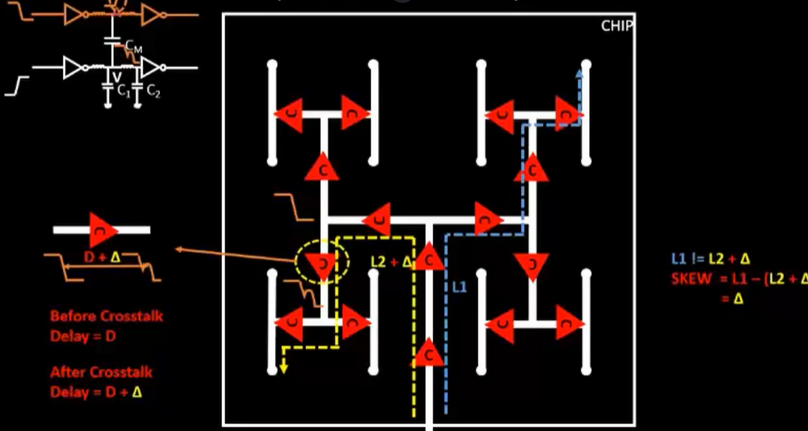

# Clock Net Shielding

Clock nets are among the most critical signals in a digital design. The clock tree is carefully constructed to minimize skew, often aiming for zero skew across all endpoints. However, this delicate balance can be disrupted by a phenomenon known as crosstalk.

## Crosstalk

**Crosstalk** occurs when a signal on one wire (the **aggressor**) unintentionally interferes with a neighboring wire (the **victim**) due to **capacitive coupling**. In high-speed circuits, this interference can cause:

* Signal distortion
* Noise and glitches
* Timing violations (e.g., hold or setup failures)
* Overall **deterioration of the clock tree’s integrity**

## Shielding Clock Nets

To mitigate crosstalk, **clock nets are shielded** — meaning they are surrounded by **non-switching metal lines** (usually tied to $V_{dd}$ or $V_{ss}$).

Shielding helps to:

* Reduce coupling capacitance between adjacent wires
* Protect victim nets from noise caused by nearby switching activity
* Maintain clean clock edges and predictable timing

### Effects of Unshielded Aggressors

If a switching aggressor net is routed near an unshielded victim net, the strong capacitive coupling can cause two major problems:

1. Glitch: A sudden voltage drop or spike on the victim line due to energy transfer from the aggressor. This can lead to incorrect data being latched into memory or flip-flops, resulting in functional errors.
2. Delta Delay: A change in the timing of signal propagation due to induced noise — this can shift arrival times and potentially violate setup or hold constraints.

### How Shielding Helps

Shielding works by placing $V_{dd}$ or $V_{ss}$ wires adjacent to critical nets (like clocks). These non-switching shields act as buffers, absorbing or blocking unwanted coupling from aggressor lines.

* Since the shields do not toggle, they do not transfer switching noise.
* This ensures that the victim net remains stable, preserving signal integrity and timing accuracy.
