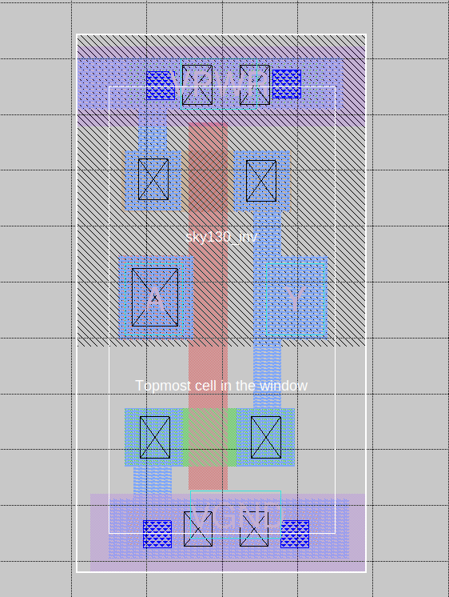
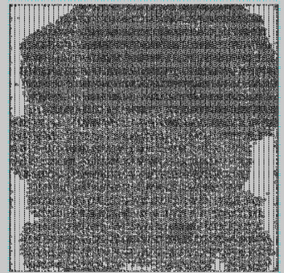
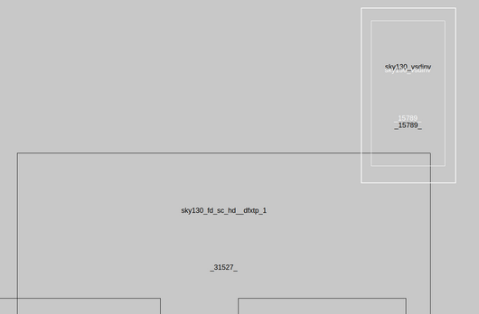

# Grid to Track

## Convert From Grid to Track

In the routing phase, we need to convert between the grid-based routing into track-based routing.

Grid-based routing is when we divide a region into a grid. We restrict routing paths to the grid lines. The space between each grid line is the *wire pitch.* Grid-based routing is easier to implement, but it doesn't work well for modern chip designs. This is because grid-based routing can't address complex routing challenges such as mixed-size macros and varying height/width constraints.

Track-based routing is what most modern chips use. Instead of a grid, we define a set of parallel routing tracks. The tracks are the channels where wires will be placed. The dimensions of the tracks are defined by the design rules of the technology node. So, the dimensional information of a 130nm node will be significantly different than a 2nm node.

The conversion process turns the conceptual grid-based routing paths into actual physical paths (the track-based routing). During the conversion process, we need to ensure that the placement and routing adhere to the design rules/constraints and make sure that each connection is stable and properly established.

### Check Track Info

Let's first check our track information.

```bash showLineNumbers title="vsduser@vsdsquadron: ~/Desktop/work/tools/openlane_working_dir/pdks/sky130A/libs.tech/openlane/sky130_fd_sc_hd"
# go to /Desktop/work/tools/openlane_working_dir/pdks/sky130A/libs.tech/openlane/sky130_fd_sc_hd


# open the tracks.info file
less tracks.info
```

The contents are as follows:

```bash showLineNumbers title="tracks.info"
li1 X 0.23 0.46
li1 Y 0.17 0.34
met1 X 0.17 0.34
met1 Y 0.17 0.34
met2 X 0.23 0.46
met2 Y 0.23 0.46
met3 X 0.34 0.68
met3 Y 0.34 0.68
met4 X 0.46 0.92
met4 Y 0.46 0.92
met5 X 1.70 3.40
met5 Y 1.70 3.40
```

### Open the Design in Magic

We need to open our chip design in Magic. This lets us view everything in an easy-to-use GUI.

```bash showLineNumbers
# go to the vsdstdcelldesign folder
cd Desktop/work/tools/openlane_working_dir/openlane/vsdstdcelldesign


# open it in magic
magic -T sky130A.tech sky130_inv.mag &
```


### Set Grid in Tkcon

```bash title="tkcon 2.3 Main"
# show grid commands
% help grid


# set the grid
% grid 0.46um 0.34um 0.23um 0.17um
```

Notice how the grid has been properly set and you can see the grid lines:



### Dimension Verification

```bash title="tkcon 2.3 Main"
# display dimensions
% box
Root cell box:
           width x height  (   llx,  lly  ), (   urx,  ury  )  area (units^2)


microns:   1.380 x 0.310   ( 0.000,  0.850), ( 1.380,  1.160)  0.428  
lambda:      138 x 31      (     0,  85   ), (   138,  116  )  4278      
```

```bash title="tkcon 2.3 Main"
# display dimensions
% box
Root cell box:
           width x height  (   llx,  lly  ), (   urx,  ury  )  area (units^2)


microns:   0.400 x 2.720   ( 0.450,  0.000), ( 0.850,  2.720)  1.088  
lambda:       40 x 272     (     45,  0   ), (   85,  272  )   10880      
```

### Save and Open the New Layout

Save:

```bash title="tkcon 2.3 Main"
# save layout with name
% save sky130_vsdinv.mag    
```

Open:

```bash showLineNumbers title="vsduser@vsdsquadron: ~/Desktop/work/tools/openlane_working_dir/openlane/vsdstdcelldesign"
# open the new layout in magic
magic -T sky130A.tech sky130_vsdinv.mag &
```

### Generate Lef

The LEF file (Library Exchange Format) will represent the physical layout information of the circuit's components. It's just a simplified and abstracted view of the physical layout. It will be used by the place and route tools.

The LEF defines the physical characteristics of standard cells, macros, etc.

```bash title="tkcon 2.3 Main"
# make the lef
% lef write    
```


### Copy the LEF and Lib Files

```bash showLineNumbers title="vsduser@vsdsquadron: ~/Desktop/work/tools/openlane_working_dir/openlane/vsdstdcelldesign"
# copy LEF
cp sky130_vsdinv.lef ~/Desktop/work/tools/openlane_working_dir/openlane/designs/picorv32a/src/


# copy lib
cp libs/sky130_fd_sc_hd__* ~/Desktop/work/tools/openlane_working_dir/openlane/designs/picorv32a/src/


# verify the files are there
ls ~/Desktop/work/tools/openlane_working_dir/openlane/designs/picorv32a/src/
```

### Edit Config

```bash showLineNumbers title="vsduser@vsdsquadron: ~/Desktop/work/tools/openlane_working_dir/openlane/designs/picorv32a"
# open config
nano config.tcl
```

Add the following lines into the file:

```showLineNumbers
set ::env(LIB_SYNTH) "$::env(OPENLANE_ROOT)/designs/picorv32a/src/sky130_fd_sc_hd__typical.lib"
set ::env(LIB_FASTEST) "$::env(OPENLANE_ROOT)/designs/picorv32a/src/sky130_fd_sc_hd__fast.lib"
set ::env(LIB_SLOWEST) "$::env(OPENLANE_ROOT)/designs/picorv32a/src/sky130_fd_sc_hd__slow.lib"
set ::env(LIB_TYPICAL) "$::env(OPENLANE_ROOT)/designs/picorv32a/src/sky130_fd_sc_hd__typical.lib"


set ::env(EXTRA_LEFS) [glob $::env(OPENLANE_ROOT)/designs/$::env(DESIGN_NAME)/src/*.lef]
```

### Re-synthesize

```bash showLineNumbers title="vsduser@vsdsquadron: ~/Desktop/work/tools/openlane_working_dir/openlane"
# go to the dir
cd Desktop/work/tools/openlane_working_dir/openlane


# open docker env -> openlane -> picorv32a
docker
./flow.tcl -interactive
package require openlane 0.9
prep -design picorv32a


# set and add our new lefs
set lefs [glob $::env(DESIGN_DIR)/src/*.lef]
add_lefs -src $lefs


# run the synthesis
run_synthesis
```


### Fix Slack Issue

Notice that we have some slack issues:


Make sure to save the values displayed above. It's always important to take backups periodically if something goes wrong.

Let's fix the issue:

```bash showLineNumbers
# re-prep to update everything
prep -design picorv32a -tag 24-03_10-03 -overwrite


# add the lef
set lefs [glob $::env(DESIGN_DIR)/src/*.lef]
add_lefs -src $lefs


# display SYNTH_STRATEGY
echo $::env(SYNTH_STRATEGY)


# set new SYNTH_STRATEGY
set ::env(SYNTH_STRATEGY) "DELAY 3"


# display SYNTH_BUFFERING
echo $::env(SYNTH_BUFFERING)


# display current SYNTH_SIZING
echo $::env(SYNTH_SIZING)


# set new  SYNTH_SIZING
set ::env(SYNTH_SIZING) 1


# display SYNTH_DRIVING_CELL
echo $::env(SYNTH_DRIVING_CELL)


# synthesize again
run_synthesis
```

Our slack issues are fixed:


## Floorplan and Placement

```bash showLineNumbers title="vsduser@vsdsquadron: ~/Desktop/work/tools/openlane_working_dir/openlane"
# run floorplan again (manual mode)
# if you do run_floorplan normally, you will encounter errors
# we will run the following commands manually instead
init_floorplan
place_io
tap_decap_or


# placement
run_placement
```

:::note

If the commands above don't work, try the following:

```bash showLineNumbers title="vsduser@vsdsquadron: ~/Desktop/work/tools/openlane_working_dir/openlane"
init_floorplan
place_io
global_placement_or
detailed_placement
tap_decap_or
detailed_placement
```

:::


### Placement in Magic

```bash showLineNumbers
# open generated def. remember to change <date> to your latest run (or the run you're using right now)
cd Desktop/work/tools/openlane_working_dir/openlane/designs/picorv32a/runs/<date>/results/placement/


# load the def in magic now
magic -T /home/vsduser/Desktop/work/tools/openlane_working_dir/pdks/sky130A/libs.tech/magic/sky130A.tech lef read ../../tmp/merged.lef def read picorv32a.placement.def &
```

**Disclaimer:** The following images were taken from the lecture. I noticed that the results I was getting weren't the same as what the professor got. I wasn't sure if it would be a major deal, but I am choosing to play it safe and use their images instead. Don't worry, only a couple images are not mine!





### Connectivity Layers

```bash title="tkcon 2.3 Main"
% expand  
```


