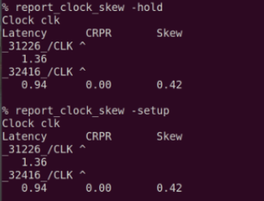

# Timing Analysis With OpenROAD

## Use OpenROAD

Make sure you run the CTS from the previous article. Then, run the following:

```bash showLineNumbers
# use openROAD
openroad

# read lef & def
read_lef /openLANE_flow/designs/picorv32a/runs/24-07_00-26/tmp/merged.lef
read_def /openLANE_flow/designs/picorv32a/runs/24-07_00-26/results/cts/picorv32a.cts.def

# create & use OpenROAD db
write_db pico_cts.db
read_db pico_cts.db

# read new netlist
read_verilog /openLANE_flow/designs/picorv32a/runs/24-07_00-26/results/synthesis/picorv32a.synthesis_cts.v

# reading the library, then linking the design
read_liberty $::env(LIB_SYNTH_COMPLETE)
link_design picorv32a

# sdc
read_sdc /openLANE_flow/designs/picorv32a/src/base.sdc

# set the clocks as a propagated clock
set_propagated_clock [all_clocks]

# make the timing report
report_checks -path_delay min_max -fields {slew trans net cap input_pins} -format full_clock_expanded -digits 4

exit
```

## Update Buffer List

```bash showLineNumbers
echo $::env(CTS_CLK_BUFFER_LIST)

# remove sky130_fd_sc_hd__clkbuf_1
set ::env(CTS_CLK_BUFFER_LIST) [lreplace $::env(CTS_CLK_BUFFER_LIST) 0 0]

echo $::env(CTS_CLK_BUFFER_LIST)
echo $::env(CURRENT_DEF)

# set def as placement def
set ::env(CURRENT_DEF) /openLANE_flow/designs/picorv32a/runs/24-07_00-26/results/placement/picorv32a.placement.def

run_cts

echo $::env(CTS_CLK_BUFFER_LIST)

openroad

# read lef & def file
read_lef /openLANE_flow/designs/picorv32a/runs/24-07_00-26/tmp/merged.lef
read_def /openLANE_flow/designs/picorv32a/runs/24-07_00-26/results/cts/picorv32a.cts.def

# create & use OpenROAD db
write_db pico_cts1.db
read_db pico_cts.db

# read new netlist
read_verilog /openLANE_flow/designs/picorv32a/runs/24-07_00-26/results/synthesis/picorv32a.synthesis_cts.v

# reading the library, then linking the design
read_liberty $::env(LIB_SYNTH_COMPLETE)
link_design picorv32a

# read sdc
read_sdc /openLANE_flow/designs/picorv32a/src/my_base.sdc

set_propagated_clock [all_clocks]

# timing report
report_checks -path_delay min_max -fields {slew trans net cap input_pins} -format full_clock_expanded -digits 4

# hold skew
report_clock_skew -hold

# setup skew
report_clock_skew -setup

exit

echo $::env(CTS_CLK_BUFFER_LIST)

# insert sky130_fd_sc_hd__clkbuf_1 to first index of list
set ::env(CTS_CLK_BUFFER_LIST) [linsert $::env(CTS_CLK_BUFFER_LIST) 0 sky130_fd_sc_hd__clkbuf_1]

echo $::env(CTS_CLK_BUFFER_LIST)
```


