# Timing Analysis With OpenSTA

## Using an Ideal Clock

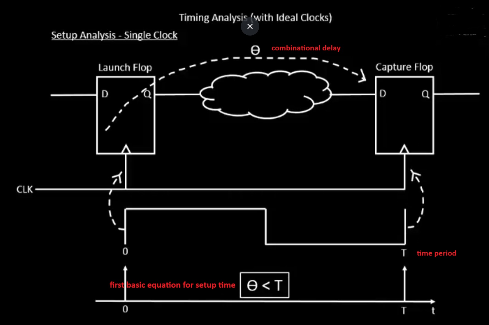

Before the clock tree is built, we can perform timing analysis using an **ideal clock** to understand key timing parameters. This serves as a baseline for evaluating the circuit’s behavior before CTS (Clock Tree Synthesis) is applied.

The specifications are as shown in the figure — for example:

* Clock Frequency (F): 1 GHz
* Clock Period (T): 1 ns

Later, a similar analysis can be performed using the **real clock** after the clock tree is implemented, allowing us to measure actual skew, latency, and path delays.

:::info[Vocab]

* $\Theta$: The combinational delay — this includes the clock-to-Q delay of the launch flip-flop plus the propagation delay through all logic gates between the launch and capture flip-flops.
* T (clock period): Also known as the *required time*, this is the total time allocated for the signal to propagate from the launch edge to the capture edge — typically defined by the inverse of the clock frequency.
* S (setup time): The *minimum time* before the active clock edge at the capture flip-flop during which the input signal must remain stable. For example, in the circuit shown below, the signal must arrive and settle at the input of Mux 2 before the next rising edge of the clock. Therefore, the delay introduced by Mux 1 must be accounted for in the setup time calculation.

:::

## Using a Real Clock

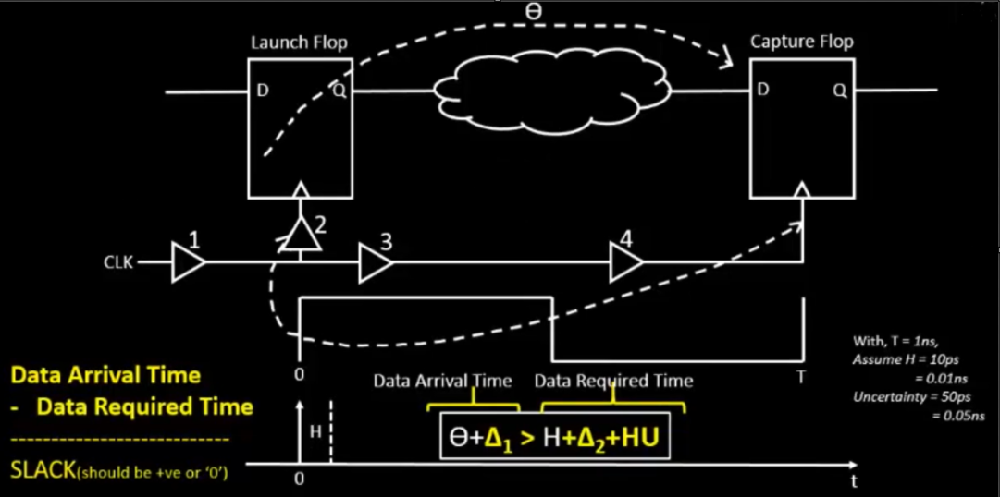

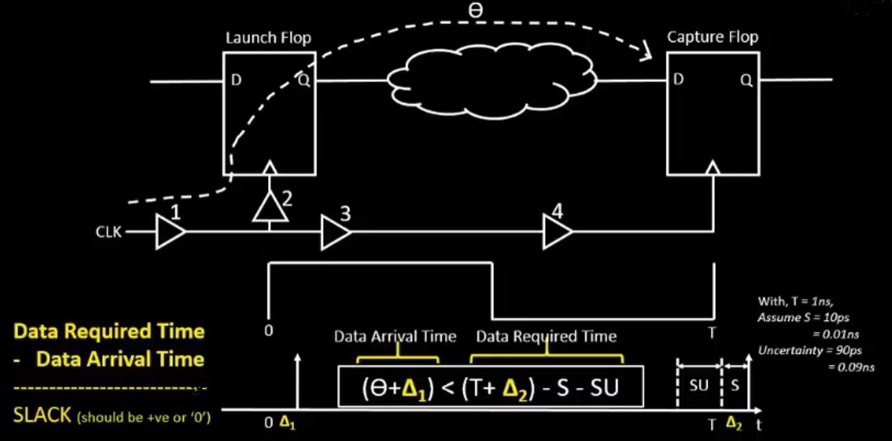

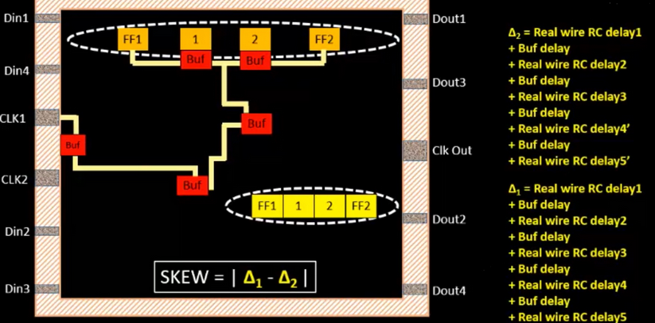

:::tip[Useful Formulas]

* Setup time: $\Theta + \Delta_{1} \lt T + \Delta_{2} - S - SU$
  * $\Theta + \Delta_{1}$ = data arrival time
  * $T + \Delta_{2}$ = data required time
* Skew: $\abs{\Delta_{1} - \Delta_{2}}$
* Hold time: $\Theta + \Delta_{1} \gt H + \Delta_{2} + HU$

:::

Once the clock tree is built, timing analysis is performed on the actual (non-ideal) clock network. Two key delays are introduced:

* $\Delta_{1}$: Clock network delay to the launch flip-flop
* $\Delta_{2}$: Clock network delay to the capture flip-flop

These values are critical in determining whether the design meets timing at the given clock frequency.

### Setup Timing and Slack

Slack = Data Required Time − Data Arrival Time

A design is considered timing-closed if slack ≥ 0 — meaning the data arrives on time or early enough.

If slack < 0, a setup violation occurs, indicating the data is arriving too late to be reliably captured, and the design will not operate correctly at the target frequency.

### Hold Timing Analysis Using Real Clocks

Hold time refers to the minimum duration that data must be held stable at the launch flip-flop’s output after the clock edge, to ensure it is correctly captured by the destination flip-flop.

Unlike setup analysis (which spans two consecutive rising edges), hold analysis happens on the same clock edge for both flip-flops.

**A hold violation occurs when:**

* The combinational path is too fast
* Clock buffer delays cause the capture flip-flop to receive the clock edge too early
* The data changes too quickly, violating the hold requirement of the destination flip-flop

:::info

* Clock period (T) and setup uncertainty (SU) are irrelevant in hold analysis (since the same rising clock edge is used at both launch and capture flops)
* Instead, focus is placed on:
  * Combinational delay
  * Clock path skews ($\Delta_{1}$ and $\Delta_{2}$)
  * Hold time requirement of the capture flop

If the path delay is too short, it can lead to incorrect or unstable data capture, even if setup timing is met.

:::

## Jitter and Uncertainty

### What is Jitter?

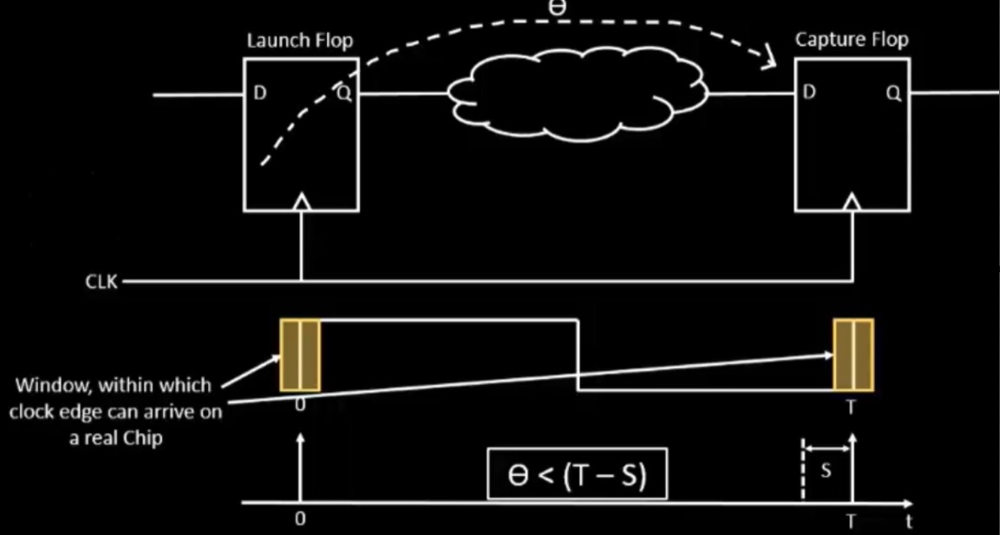

In most digital systems, clock signals are generated by a **PLL** (Phase-Locked Loop), which is designed to produce clock pulses at regular intervals — ideally at 0, T, 2T, 3T, ..., where *T* is the clock period.

However, in reality, even high-quality PLLs exhibit some amount of timing variation, known as **jitter**.

Jitter refers to the *short-term fluctuations* in the exact timing of clock signal transitions. Instead of arriving exactly at T nanoseconds, a clock edge might arrive slightly earlier or later due to jitter, causing *deviations from the expected timing*.

This variation can **affect both clock and data signals**, and becomes especially critical in high-speed or tightly timed designs, where even small timing errors can lead to **setup or hold violations**.

### What is Uncertainty?

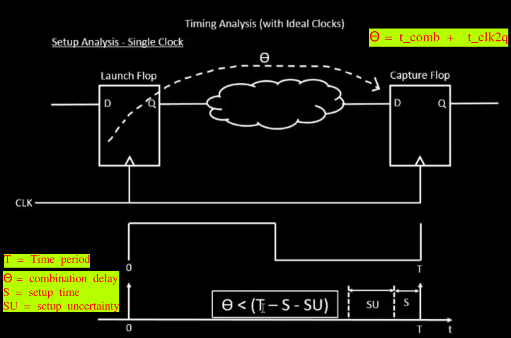

:::info[Vocab]

* SU (Setup Uncertainty): Setup uncertainty arises from jitter — the short-term, unpredictable variation in the clock period caused by non-idealities in the PLL (Phase-Locked Loop). This uncertainty reduces the effective time available for data to propagate and settle before being captured, and must be accounted for during timing closure.

:::

## Running the Post-Synthesis Timing Analysis via OpenSTA

Make sure that you already did the following in the docker + OpenLANE terminal environment:

```bash showLineNumbers
prep -design picorv32a
set lefs [glob $::env(DESIGN_DIR)/src/*.lef]
add_lefs -src $lefs
set ::env(SYNTH_SIZING) 1
run_synthesis
```

### `pre_sta.conf` File Contents

There should be a `pre_sta.conf` file in the OpenLANE directory.

Run `nano pre_sta.conf` to view its contents:

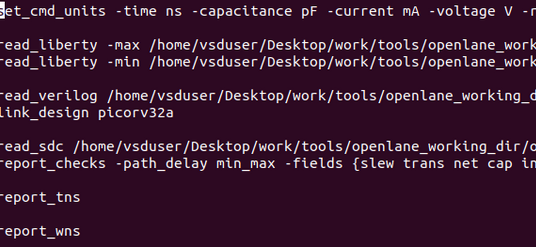

### `my_base.sdc` File Contents

There will also be a `my_base.sdc` file in the `/openlane/designs/picorv32a/src` directory. `cd` into the directory and view the file contents:

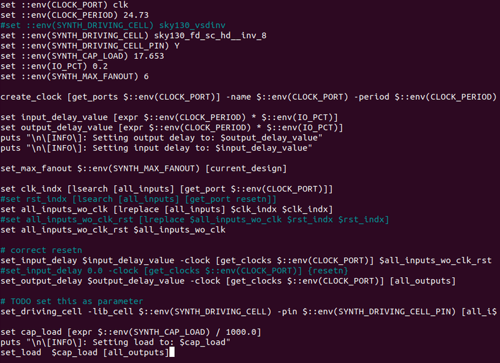

### Run STA

Make sure you are in the OpenLANE directory. Then, run the following:

```bash showLineNumbers title="vsduser@vsdsquadron: ~/Desktop/work/tools/openlane_working_dir/openlane"
sta pre_sta.conf
```

Uh oh. Looks like our slack is really bad:

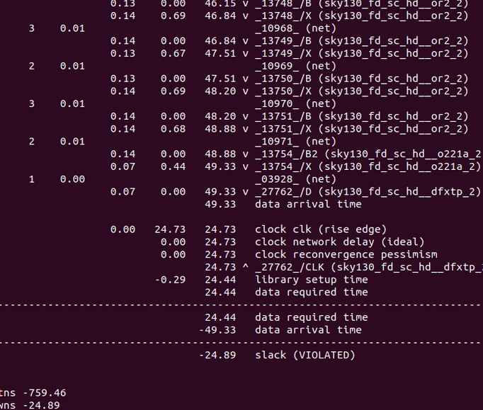

Identify any gates that drive too many fanouts with too little strength. You may have found an OR gate like this! (Hint: try it yourself!)

You can replace the weak gate and then re-run the analysis:

```bash showLineNumbers title="vsduser@vsdsquadron: ~/Desktop/work/tools/openlane_working_dir/openlane"
report_net -connections _11672_
help replace_cell


# this replaces the cell
replace_cell _14513_ sky130_fd_sc_hd__or3_4


# generate a timing report
report_checks -fields {net cap slew input_pins} -digits 4
```

You will notice that the slack is reduced:

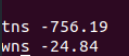

It wasn't a huge improvement, but it's a start! Continue looking for problematic gates, optimizing them until the slack is *significantly* reduced. Afterwards, run `cp picorv32a.synthesis.v picorv32a.synthesis_old.v` to replace the old netlist with the new one.

Write the verilog with `write_verilog /home/vsduser/Desktop/work/tools/openlane_working_dir/openlane/designs/picorv32a/runs/<date>/results/synthesis/picorv32a.synthesis.v`. Make sure to replace `<date>` with the run you are using.

## Clock Timing Synthesis (CTS)

Run `run_cts` to start the CTS.

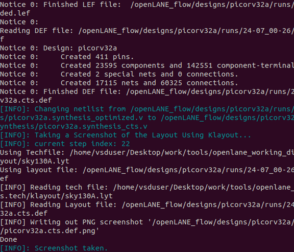
