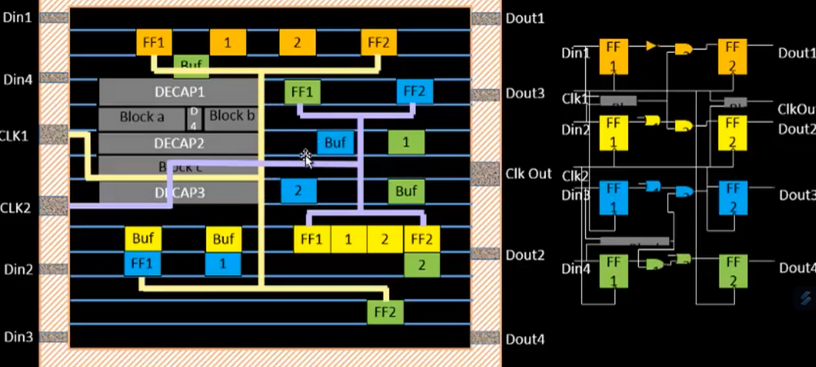

# CTS w/TritonCTS and Signal Integrity

## CTS H-Tree

In the first image figure above, the **CLK port** connects to the clock pins of various **flip-flops**, based on connectivity information. However, in this example, the connections were made without considering physical factors — resulting in a situation where $t_{2} \gt t_{1}$, meaning the clock arrives later at one flip-flop than the other.

This difference in arrival time is called **clock skew**.

### Clock Skew

Clock skew is the variation in arrival times of the clock signal at different points within a synchronous system. More specifically, it is the difference in propagation delay of the clock signal as it travels through different paths to reach flip-flops.

Skew can be caused by:

* Differences in **wire lengths**
* Variations in **routing paths**
* Uneven **buffer insertion delays**
* Physical and environmental factors (temperature, voltage, etc.)

As a result, some parts of the circuit may receive the clock **earlier or later** than others — potentially leading to **timing violations** such as setup or hold failures.

Ideally, the skew should be as close to zero as possible.

:::danger[Why This Is a "Bad" Clock Tree]

In the diagram, the clock tree is poorly constructed — the skew is significant due to unbalanced routing. This makes it a **bad clock tree**, as it undermines the core requirement of synchronous design: that all flip-flops receive the clock **at nearly the same time**.

:::

### Optimizing with H-Tree Routing

One common solution to balance skew is **H-Tree routing**. This method works as follows:

1. Calculate the **geometric center** (midpoint) between all clock endpoints.
2. Route the clock to that midpoint, then recursively find midpoints of each segment.
3. At each midpoint, **split the wire** symmetrically.
4. Repeat until the signal reaches all flip-flops.

The result is a **symmetrical, balanced tree**, where the clock travels equal distances to each destination — minimizing skew.

### Signal Integrity and Buffer Insertion

While H-Tree routing balances delays, the **clock signal can still degrade** due to **resistance and capacitance** in long wires — causing distortion or attenuation.

To address this, **clock buffers (repeaters)** are inserted at regular intervals to:

* Restore signal strength
* Maintain sharp transitions
* Preserve timing integrity

### Clock vs Data Buffers: Key Differences

* **Clock Buffers:** Designed with equal rise and fall times to maintain symmetric timing across the clock network — essential for predictable timing closure.
* **Data Buffers:** Rise and fall times may differ depending on signal conditions, load, and logic behavior. The emphasis here is on functional correctness rather than perfect symmetry.
