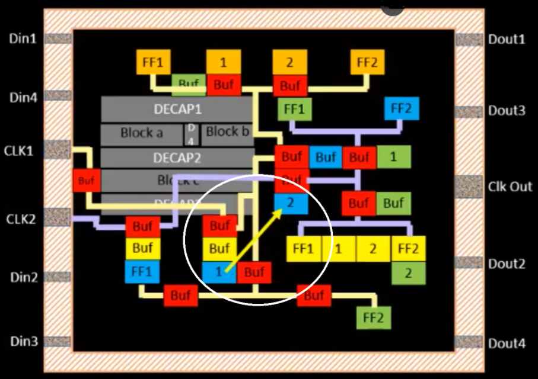
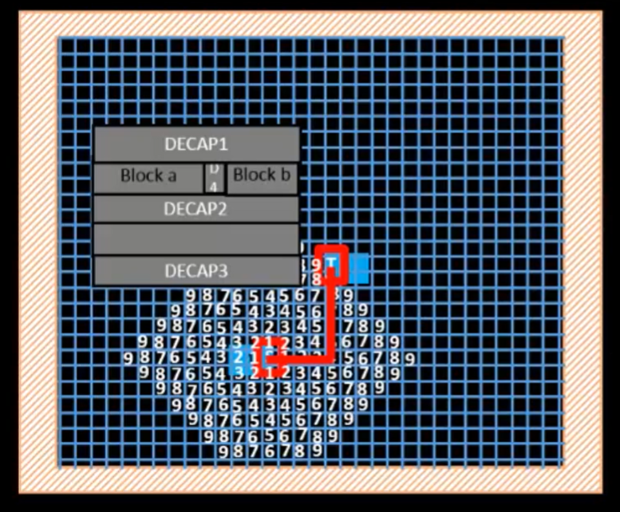

# Maze Routing

In order to make the best chip possible while spending the least amount of money, we need to perform good routing. Routing is the process of creating connections between different circuits. Because of the importance of routing, algorithms have been developed to efficiently and optimally create routes.

## Lee's Algoritm

Wires need to be routed around obstacles and macros, ideally in a path that is short, clean (few bends), and legal. Lee’s Algorithm, a classic maze routing algorithm, can help.

### Problem Context

* Goal: Find the shortest legal path between a source and target in a grid-based space (think of the chip layout as a maze).
* Constraints:
  * The path must not be diagonal
  * The path must not overlap with blockages, like macros, HIPs, or other routed wires
  * The preferred path has minimal bends (favoring L-shapes over zig-zags)

### The Algorithm

1. Represent the routing region as a 2D grid (matrix).
2. Each grid cell is marked as one of the following:
   1. `S`: **Source**
   2. * `T`: **Target**
   3. * `#`: **Obstacle** (macros, HIPs, blockages)
   4. * `.`: **Empty cell** (free routing space)
   5. `+`: **Visited cell** during wave propagation
3. Wave Expansion
   1. Begin from the source cell (`S`) and spread outward in all 4 directions (up, down, left, right).
   2. Each newly visited cell is marked with a wavefront value, which is one more than the minimum of its visited neighbors.
   3. This creates a growing wave across the grid, effectively computing the shortest number of steps to reach any cell.
   4. The expansion continues until the target `T` is reached, or all paths are exhausted.
4. 🔁 Backtracking & Path Reconstruction
   1. Once `T` is reached, the algorithm begins backtracking to reconstruct the path:
   2. From `T`, move to any neighboring cell with a value one less than the current.
   3. Continue until reaching `S`.
   4. Among all possible shortest paths, the router may choose the one with the fewest bends, improving signal integrity and reducing delay.
