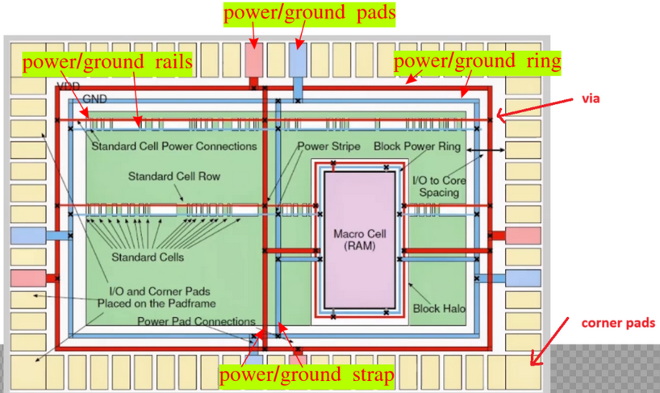

# Power Distribution Network (PDN)

## Build the PDN

```bash showLineNumbers title="vsduser@vsdsquadron: ~/Desktop/work/tools/openlane_working_dir/openlane"
# make sure to be in ~/Desktop/work/tools/openlane_working_dir/openlane
docker
./flow.tcl -interactive
prep -design picorv32a -tag <folder name of the CTS>

# double check the design is the right one
$::env(CURRENT_DEF)

# make the PDN
gen_pdn
```


Check the pitch of the Stdcell Rails section. The pitch should be 2.72, and it represents the height of the inverter cells and the power + ground rails. If the heights of the cells and rails don't match properly, then the power delivery won't work.

## Power/Ground Pads, Rings, Rails, and Straps



1. Power is delivered through the pads. The ground is connected to the pads too.
2. The power and ground wires are arranged in a ring around the circuits.
3. Rails for power and ground cross the entire chip, connected to straps.
4. The rails deliver power and ground to the needed cells.
