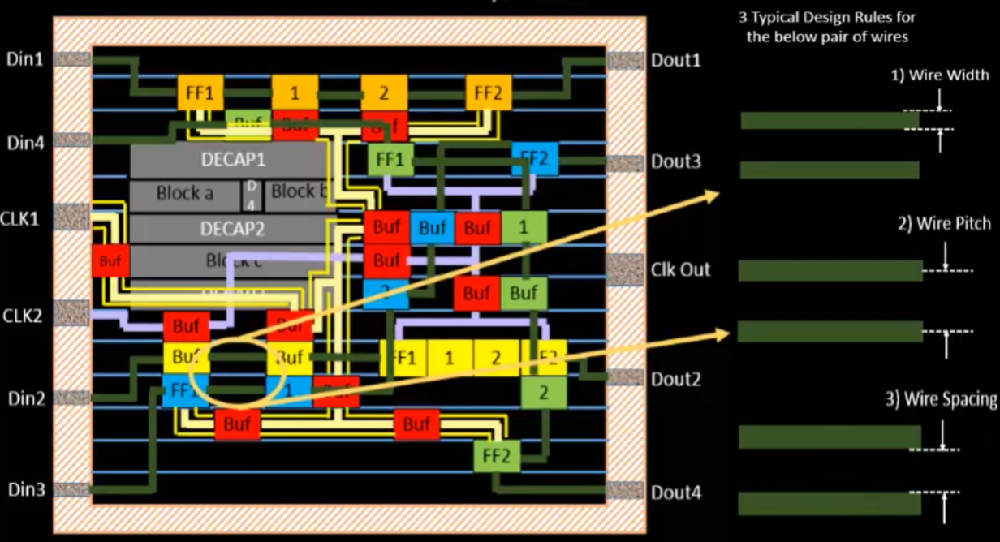
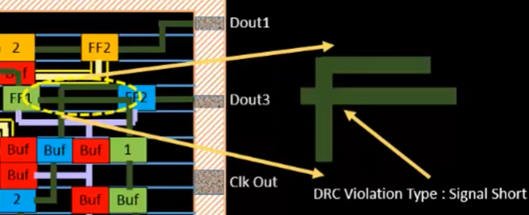
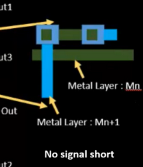

# Routing DRC

## Key DRC Constraints During Routing

1. Minimum Wire Width
   1. Ensures wires are thick enough to carry current without breaking or degrading during fabrication.
2. Minimum Spacing Between Wires
   1. Prevents electrical shorts and crosstalk by maintaining enough distance between adjacent signal lines.
3. Minimum Pitch
   1. Defines the sum of wire width + spacing, critical for density planning.

These rules are technology-dependent, defined by the foundry for each process node (e.g. 7nm, 5nm, etc.).

## Signal Shorts and Layer Switching

A common routing error is a signal short, where two nets accidentally touch. This leads to functional failure and must be avoided.

### Fix

* Layer switching via vias is often used to bypass congestion or fix violations.
* However, this introduces new DRCs:
  * Via Width and Spacing rules
  * Metal Layer Width Scaling (higher metal layers usually require wider wires)
  * Layer-to-layer alignment and density rules

## DRC Cleaning

After initial routing, tools perform DRC cleaning to:

* Detect and fix violations (spacing, width, short, enclosure, etc.)
* Ensure that the layout meets all foundry manufacturing constraints
* Guarantee the design is printable and manufacturable in silicon

Only once a design is DRC-clean can it proceed to signoff and tape-out.
