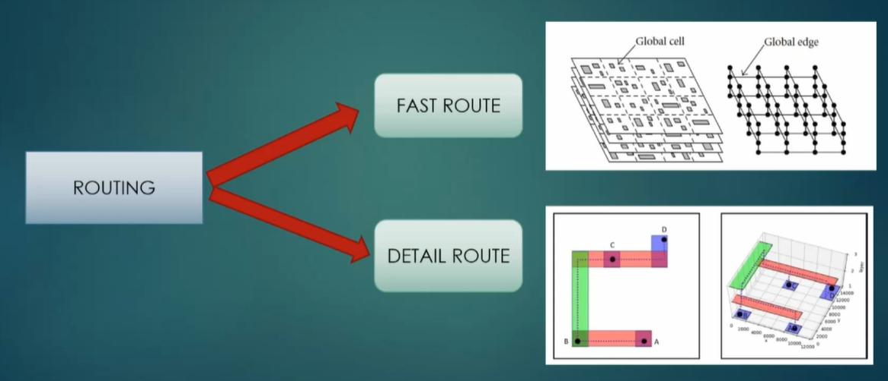
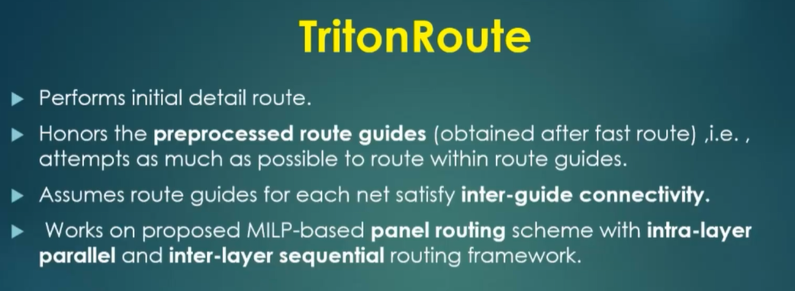
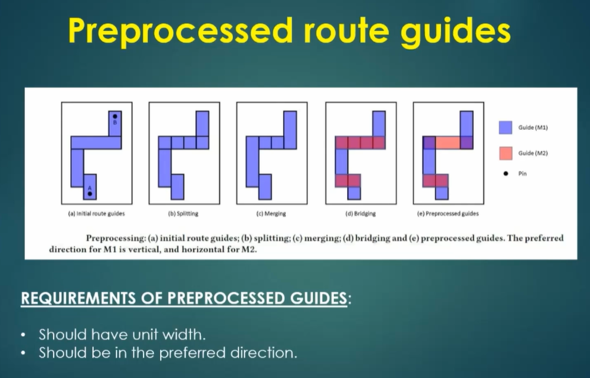
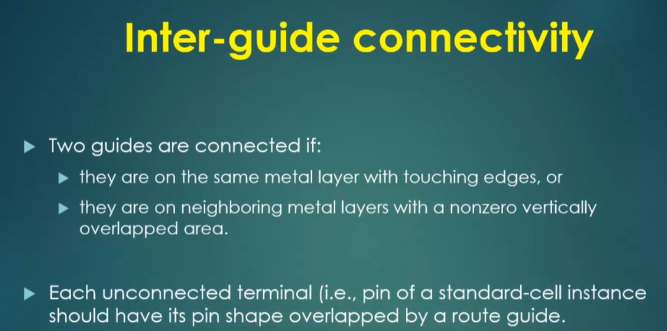
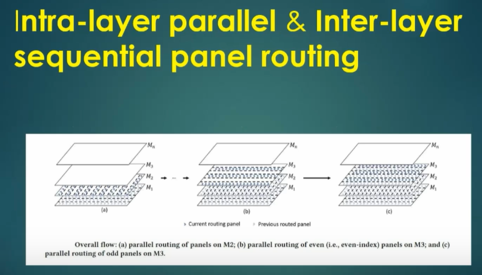
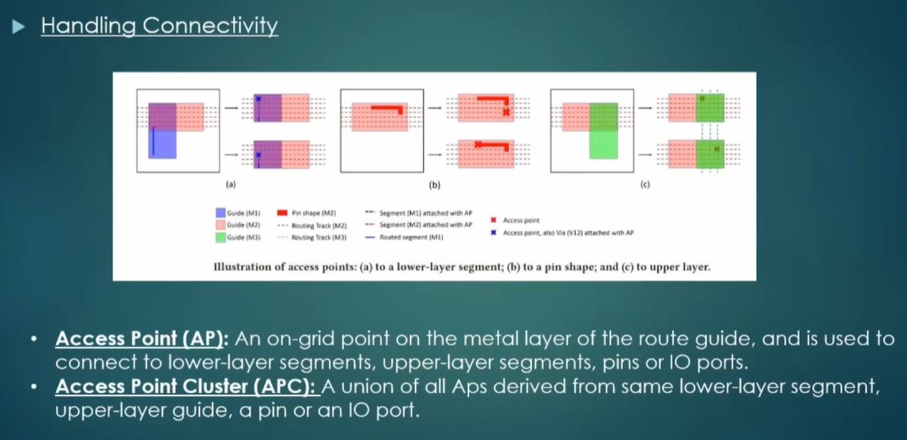
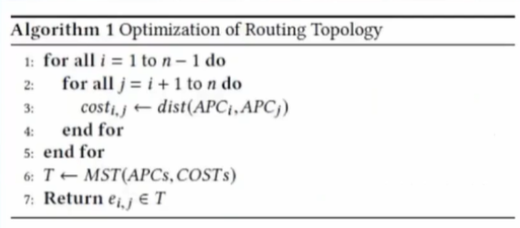

# TritonRoute

## Routing



In the VLSI physical design flow, the routing stage is highly critical and determines the final signal paths connecting various components. Routing can be performed using open-source or commercial EDA tools, and it is typically divided into two major phases:

### Global Routing (Fast Route)

* Purpose: Establishes the initial routing framework.
* Method: The layout area is partitioned into tiles or grid cells, and the tool determines which regions each net should pass through.
* Characteristics:
  * Uses approximate, fast algorithms
  * Does not produce exact wire geometries
  * Identifies routing congestion and resource estimation
* Outcome: Guides the detailed router by indicating preferred routing regions.

### Detailed Routing

* Purpose: Completes the routing with exact geometries that meet all design rules.
* Method: Implements track-based routing algorithms to lay down each wire precisely.
* Characteristics:
  * Focuses on pin-to-pin connectivity
  * Enforces Design Rule Checks (DRC) such as width, spacing, via rules, etc.
  * Resolves shorts, opens, and violations
* Outcome: Produces a DRC-clean, fully connected layout ready for signoff.

## TritonRoute Features



TritonRoute is a popular routing engine. It's an open-source detailed router and it was developed at the University of California, San Diego. It is a key component of the OpenROAD project. Let's go over the useful features it has.

### TritonRoute Feature 1 — Honors Pre-Processed Route Guides



TritonRoute strictly adheres to pre-processed routing guides generated during global routing. These guides dictate the preferred routing directions for each metal layer—commonly:

* Metal 1 (M1): Preferred vertical routing
* Metal 2 (M2): Preferred horizontal routing

#### Handling Non-Preferred Routing

When TritonRoute encounters a segment routed in a non-preferred direction, it takes the following steps:

1. Splitting:
   1. The non-preferred route is split into unit-width segments.
   2. This helps isolate portions that can be realigned to follow preferred directions.
2. Combining:
   1. Segments that align with the preferred direction are recombined to simplify routing.
3. Bridging:
   1. Where necessary, vias are inserted to bridge segments to upper metal layers (e.g., M3 or above), preserving directionality and avoiding congestion.
4. Conversion:
   1. The tool may convert non-preferred routes into preferred routing guides on higher layers like M2, enhancing routing quality and DRC compliance.

### TritonRoute Feature 2 & 3 — Inter-Guide Connectivity and Intra/Inter-Layer Routing

TritonRoute incorporates advanced strategies for navigating complex routing spaces across both guides (regions suggested for routing) and metal layers. These strategies ensure efficient use of space while preserving design rule compliance and routing performance.

#### Feature 2: Inter-Guide Connectivity



* Each routing layer (e.g., M1, M2) is divided into panels based on pre-defined routing guides.
* For M1, the preferred direction is vertical, resulting in vertical tracks confined within these panels.

*Panel Routing Strategy:*

* Panels are indexed (e.g., even or odd).
* Routing is performed in two passes:
  1. First Pass: Routing is done in even-indexed panels.
  2. Second Pass: Routing is then completed in odd-indexed panels.
* This intra-layer panel routing maintains routing within a single metal layer and ensures that congestion is minimized within and between panels.
* Inter-guide routing connects nets that span across adjacent guides/panels, enabling end-to-end connectivity across the chip.

#### Feature 3: Intra & Inter-Layer Routing



* After panel-based routing within a layer is completed, routing progresses upward through the metal stack (e.g., from M1 → M2 → M3).
* Intra-layer routing ensures complete signal path formation within a single layer whenever possible.
* Inter-layer routing is accomplished using vias, which vertically connect nets from one metal layer to another.

### Handling Connectivity





In TritonRoute, MILP (Mixed Integer Linear Programming) is leveraged to determine the optimal routing solution between Access Point Clusters (APCs). The objective is to efficiently connect different parts of a net while minimizing total routing cost and respecting design constraints.

#### Goal

To identify the minimum-cost connection between two APCs by:

* Evaluating each access point (pin or via point),
* Determining the most efficient interconnect strategy using a Minimum Spanning Tree (MST) approach.

#### MILP-Based Connectivity Algorithm Steps

1. Cost Evaluation
   * Compute a routing cost for each access point within the two clusters.
   * Costs may include wire length, congestion, via usage, DRC violations, or other penalties.
2. Graph Construction
   * Form a graph with all access points as nodes.
   * The edge weights between points represent the computed routing costs.
3. Minimum Spanning Tree (MST)
   * Apply an MST algorithm (e.g., Kruskal’s or Prim’s) to the graph.
   * The MST connects all access points with minimum total cost.
4. Optimal Access Point Pair Selection
   * From the MST, identify the best pair of access points—one from each cluster—that yields the least cost.
   * This pair becomes the chosen connection path between the two APCs.

#### Key Benefits

* Ensures optimal connectivity across complex routing structures.
* Reduces total wire length and via usage.
* Helps maintain DRC (Design Rule Check) compliance.
* Enhances routing efficiency and yield reliability.

## Run the Routing

Make sure you did `run_routing`. This will do the global and detailed routing. Routing runs in stages, so it will route the chip several times over until there are 0 DRC violations or until it can't fix anything anymore (at that point, manual intervention will be required). It can take a decently long time to complete.

The routing logs might look like the following:

```plaintext
start 1st optimization iteration ...
      // highlight-next-line
      completing 10% with 25470 violations
      elapsed time = 00:00:7, memory = 683.09 (MB)
      completing 20% with 25470 violations
      elapsed time = 00:00:39, memory = 798.34 (MB)

      [content hidden]

   // highlight-next-line
   number of violations = 12012
```

With each iteration, the violation count will decrease.

```plaintext
start 33rd optimization iteration ...
      // highlight-next-line
      completing 10% with 2 violations
      elapsed time = 00:00:7, memory = 683.09 (MB)
      completing 20% with 2 violations
      elapsed time = 00:00:39, memory = 798.34 (MB)

      [content hidden]

   // highlight-next-line
   number of violations = 0
```

:::info

If there are violations remaining, you may have to fix them manually.

:::

## Open the DEF

There should be a file called `runs/<date>/results/routing/picorv32.def`. Open it in Magic.


